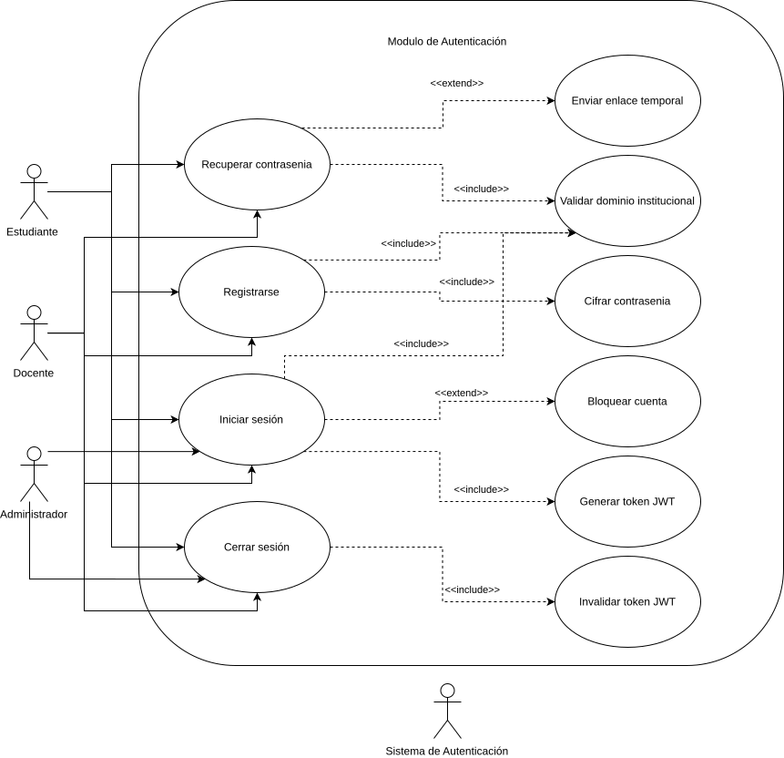
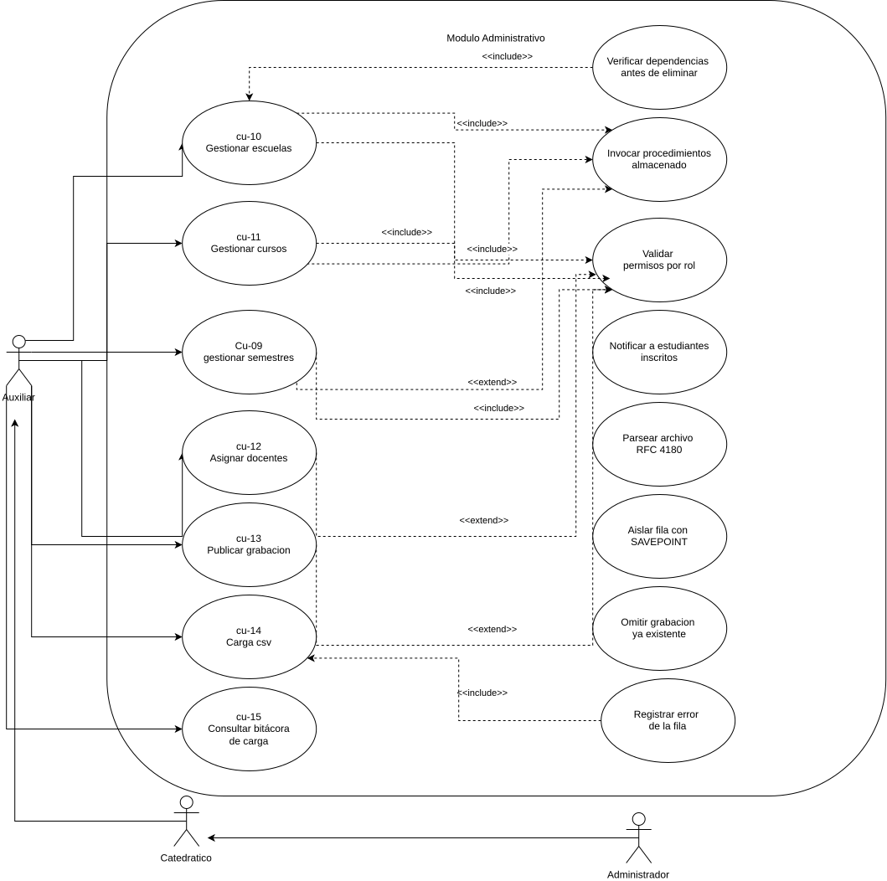
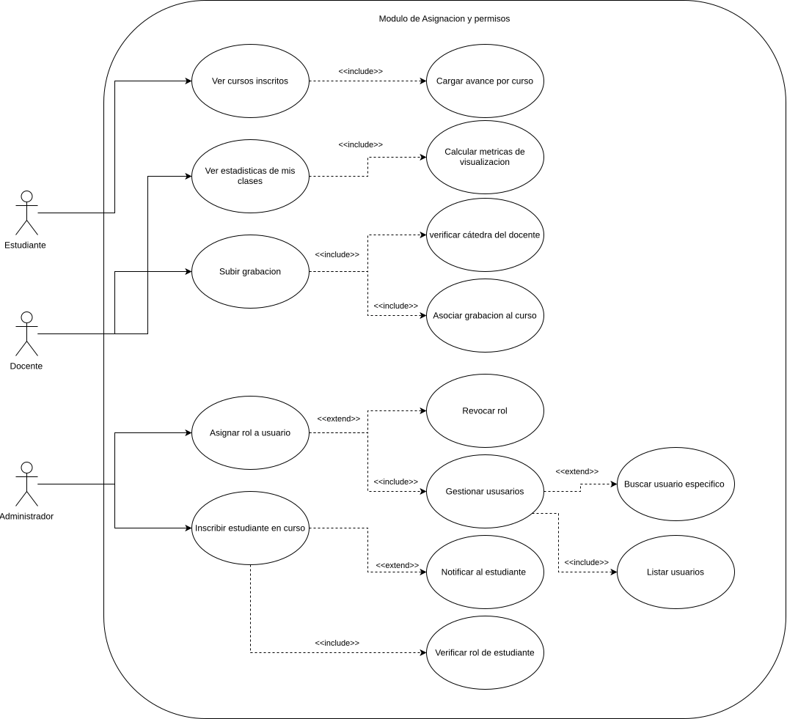
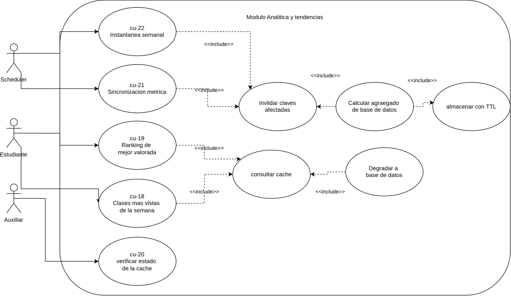
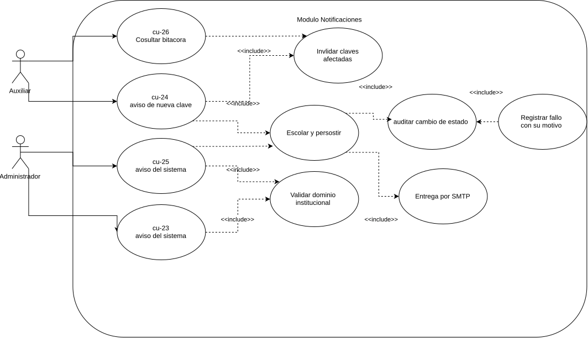

# Casos de Uso Expandidos — YoUSAC

Narrativas de los 27 casos de uso identificados, con flujo principal, flujos
alternativos y flujos de excepción.

La numeración corresponde a la del [Diagrama de Casos de Uso de Alto Nivel](./Diagrama_Alto_Nivel.drawio.svg).
Los casos CU-09 a CU-26 se agrupan además en los diagramas de descomposición por
módulo.

| Rango | Módulo | Diagrama de descomposición |
|---|---|---|
| CU-01 a CU-03 | Autenticación | [Módulo 1](./Descomposicion_Modulo1.drawio.svg) |
| CU-04 a CU-05 | Catálogo y búsqueda | [Módulo 2](./Descomposicion_Modulo2.drawio.svg) |
| CU-06 a CU-08 | Reproducción y progreso | [Módulo 3](./Descomposicion_Modulo3.drawio.svg) |
| CU-16, CU-17, CU-27 | Asignaciones y permisos | [Módulo 4](./Descomposicion_Modulo4.drawio.svg) |
| CU-09 a CU-15 | Panel administrativo y carga masiva | [Módulo 5](./Descomposicion_Modulo5.drawio.svg) |
| CU-18 a CU-22 | Analítica y tendencias | [Módulo 6](./Descomposicion_Modulo6.drawio.svg) |
| CU-23 a CU-26 | Notificaciones | [Módulo 7](./Descomposicion_Modulo7.drawio.svg) |

> Los roles del sistema son **Estudiante**, **Catedrático**, **Auxiliar** y
> **Administrador**. Cada rol hereda los permisos del anterior: un Catedrático
> puede hacer todo lo que un Auxiliar, y un Administrador todo lo que un
> Catedrático.

---

## CU-01: Registrarse con Correo Institucional

| Campo | Detalle |
|-------|---------|
| **ID** | CU-01 |
| **Nombre** | Registrarse |
| **Actor principal** | Estudiante, Catedrático, Auxiliar |
| **Actor secundario** | Sistema de Autenticación |
| **Precondición** | El usuario no tiene una cuenta registrada en el sistema |
| **Postcondición** | El usuario queda registrado con rol Estudiante por defecto y puede iniciar sesión |

### Flujo Principal
1. El usuario accede a la pantalla de registro.
2. El usuario ingresa su correo institucional, nombre completo y contraseña.
3. El sistema valida que el correo pertenezca al dominio @ingenieria.usac.edu.gt o @ing.usac.edu.gt.
4. El sistema valida que la contraseña cumpla los requisitos mínimos de seguridad.
5. El sistema cifra la contraseña con bcrypt (factor de coste 12).
6. El sistema almacena el nuevo usuario con rol Estudiante por defecto.
7. El sistema notifica al usuario que el registro fue exitoso.
8. El sistema redirige al usuario a la pantalla de inicio de sesión.

### Flujos Alternativos
- **FA-01 — El correo ya está registrado:** En el paso 3, si el correo ya existe en la base de datos, el sistema muestra el mensaje "Este correo ya tiene una cuenta registrada" y ofrece la opción de recuperar contraseña.

### Flujos de Excepción
- **FE-01 — Dominio no institucional:** En el paso 3, si el dominio del correo no corresponde al institucional, el sistema rechaza el registro y muestra "Solo se permiten correos institucionales de la Facultad de Ingeniería".
- **FE-02 — Contraseña débil:** En el paso 4, si la contraseña no cumple los requisitos mínimos, el sistema muestra los criterios no cumplidos sin procesar el registro.
- **FE-03 — Error de conexión:** En el paso 6, si ocurre un fallo en la base de datos, el sistema muestra "Error al crear la cuenta, intente nuevamente" sin guardar datos parciales.

### Diagrama local

---

---

## CU-02: Iniciar Sesión

| Campo | Detalle |
|-------|---------|
| **ID** | CU-02 |
| **Nombre** | Iniciar sesión |
| **Actor principal** | Estudiante, Catedrático, Auxiliar, Administrador |
| **Actor secundario** | Sistema de Autenticación |
| **Precondición** | El usuario tiene una cuenta registrada y activa en el sistema |
| **Postcondición** | El usuario obtiene un token JWT válido y accede a la plataforma según su rol |

### Flujo Principal
1. El usuario accede a la pantalla de inicio de sesión.
2. El usuario ingresa su correo institucional y contraseña.
3. El sistema valida que el correo pertenezca al dominio institucional.
4. El sistema verifica que la cuenta no esté bloqueada.
5. El sistema compara la contraseña ingresada con el hash almacenado.
6. El sistema genera un token JWT con expiración de 8 horas y los datos del rol del usuario.
7. El sistema redirige al usuario a la pantalla principal según su rol.

### Flujos Alternativos
- **FA-01 — Usuario ya tiene sesión activa:** Si el usuario accede con un JWT válido aún vigente, el sistema redirige directamente a la pantalla principal sin solicitar credenciales nuevamente.

### Flujos de Excepción
- **FE-01 — Credenciales incorrectas:** En el paso 5, si la contraseña no coincide, el sistema incrementa el contador de intentos fallidos, muestra "Correo o contraseña incorrectos" y no especifica cuál de los dos es incorrecto.
- **FE-02 — Cuenta bloqueada:** En el paso 4, si la cuenta está bloqueada por exceder 5 intentos fallidos, el sistema muestra "Cuenta bloqueada temporalmente, revise su correo institucional".
- **FE-03 — Dominio inválido:** En el paso 3, si el correo no pertenece al dominio institucional, el sistema rechaza el intento sin consultar la base de datos.

### Diagrama local

---

---

## CU-03: Cerrar Sesión

| Campo | Detalle |
|-------|---------|
| **ID** | CU-03 |
| **Nombre** | Cerrar sesión |
| **Actor principal** | Estudiante, Catedrático, Auxiliar, Administrador |
| **Actor secundario** | Servicio de Autenticación |
| **Precondición** | El usuario tiene una sesión activa con un token JWT válido |
| **Postcondición** | El token queda revocado y la cookie de sesión eliminada del navegador |

### Flujo Principal
1. El usuario selecciona la opción de cerrar sesión.
2. El sistema envía el token actual al servicio de autenticación.
3. El servicio registra el identificador del token en la lista de tokens revocados.
4. El sistema registra la acción en la bitácora de auditoría.
5. El gateway elimina la cookie de sesión del navegador.
6. El sistema redirige al usuario a la pantalla de inicio de sesión.

### Flujos Alternativos
- **FA-01 — Cierre por expiración:** Si el token expira durante el uso, el sistema detecta la respuesta 401, limpia la sesión local y redirige al login sin intervención del usuario.

### Flujos de Excepción
- **FE-01 — El servicio de autenticación no responde:** En el paso 2, si la revocación falla, el sistema elimina de todas formas la sesión local y la cookie. El token seguirá siendo válido hasta su expiración natural, por lo que la sesión del navegador queda cerrada aunque el token no esté revocado en el servidor.

### Diagrama local

---

## CU-04: Explorar Catálogo Paginado

| Campo | Detalle |
|-------|---------|
| **ID** | CU-04 |
| **Nombre** | Ver catálogo |
| **Actor principal** | Estudiante, Catedrático, Auxiliar, Administrador |
| **Precondición** | El usuario tiene una sesión activa con token JWT válido |
| **Postcondición** | El usuario visualiza el listado paginado de grabaciones disponibles según su rol |

### Flujo Principal
1. El usuario autenticado accede a la sección de catálogo.
2. El sistema valida el token JWT del usuario.
3. El sistema identifica el rol del usuario.
4. Si el usuario es Estudiante, el sistema filtra las grabaciones según los cursos en los que está inscrito.
5. Si el usuario es Docente o Administrador, el sistema carga el catálogo completo.
6. El sistema muestra las grabaciones paginadas (20 por página) con miniatura, título, catedrático, curso, duración y porcentaje de recomendación.
7. El usuario puede navegar entre páginas del catálogo.

### Flujos Alternativos
- **FA-01 — El estudiante no tiene cursos inscritos:** En el paso 4, si el estudiante no tiene ningún curso inscrito, el sistema muestra el mensaje "No tienes cursos inscritos aún. Contacta al administrador".
- **FA-02 — El usuario aplica filtros:** Desde el catálogo, el usuario puede iniciar el flujo CU-05 para refinar los resultados.

### Flujos de Excepción
- **FE-01 — Token expirado:** En el paso 2, si el token JWT ha expirado, el sistema redirige al usuario a la pantalla de inicio de sesión.
- **FE-02 — Sin grabaciones disponibles:** Si no hay grabaciones publicadas para los cursos del estudiante, el sistema muestra "No hay grabaciones disponibles por el momento".

### Diagrama local

---

---

## CU-05: Filtrar y Buscar Grabaciones

| Campo | Detalle |
|-------|---------|
| **ID** | CU-05 |
| **Nombre** | Buscar y filtrar grabaciones |
| **Actor principal** | Estudiante, Catedrático, Auxiliar, Administrador |
| **Precondición** | El usuario tiene sesión activa y se encuentra en la pantalla del catálogo |
| **Postcondición** | El sistema muestra los resultados que coinciden con los criterios de búsqueda aplicados |

### Flujo Principal
1. El usuario accede al panel de búsqueda y filtros en el catálogo.
2. El usuario ingresa un término de búsqueda en el campo de texto libre y/o selecciona uno o más filtros (semestre/año, escuela, curso, catedrático).
3. El sistema ejecuta la consulta combinando los criterios ingresados.
4. El sistema aplica la restricción de cursos inscritos si el actor es Estudiante.
5. El sistema muestra los resultados paginados ordenados por relevancia por defecto.
6. El usuario puede cambiar el criterio de ordenamiento (fecha de publicación, calificación promedio).

### Flujos Alternativos
- **FA-01 — El usuario limpia los filtros:** El usuario puede restablecer todos los filtros para volver al catálogo completo.
- **FA-02 — El usuario aplica solo filtros sin texto:** El sistema ejecuta la búsqueda usando únicamente los filtros seleccionados.

### Flujos de Excepción
- **FE-01 — Sin resultados:** Si ninguna grabación coincide con los criterios, el sistema muestra "No se encontraron grabaciones con los filtros aplicados" y sugiere ampliar la búsqueda.
- **FE-02 — Error en la consulta:** Si el servicio de catálogo no responde, el sistema muestra "Error al cargar resultados, intente nuevamente".

### Diagrama local

---

---

## CU-06: Reproducir Clase con Checkpoint

| Campo | Detalle |
|-------|---------|
| **ID** | CU-06 |
| **Nombre** | Reproducir video |
| **Actor principal** | Estudiante, Catedrático |
| **Precondición** | El usuario tiene sesión activa y selecciona una grabación a la que tiene acceso |
| **Postcondición** | El video se reproduce desde el último checkpoint registrado o desde el inicio si es la primera vez |

### Flujo Principal
1. El usuario selecciona una grabación del catálogo.
2. El sistema verifica que el usuario tenga acceso al curso al que pertenece la grabación.
3. El sistema consulta si existe un checkpoint previo del usuario para esa grabación.
4. Si existe checkpoint, el sistema carga el video desde esa posición.
5. Si no existe checkpoint, el sistema inicia el video desde el principio.
6. El video comienza a reproducirse en el reproductor embebido de la plataforma.
7. El sistema inicia el registro automático de checkpoints cada 30 segundos.

### Flujos Alternativos
- **FA-01 — El usuario cambia la resolución:** Durante la reproducción, el usuario puede seleccionar entre 720p y 1080p sin interrumpir el checkpoint activo.
- **FA-02 — El usuario pausa y reanuda:** El sistema registra el checkpoint en el momento de la pausa y reanuda desde esa posición.

### Flujos de Excepción
- **FE-01 — Sin acceso al curso:** En el paso 2, si el estudiante no está inscrito en el curso de la grabación, el sistema muestra "No tienes acceso a esta grabación" y redirige al catálogo.
- **FE-02 — Error de carga del video:** Si el servicio de streaming no responde, el sistema muestra "Error al cargar el video, intente más tarde".
- **FE-03 — Sesión expirada durante reproducción:** Si el JWT expira mientras el usuario reproduce el video, el sistema guarda el checkpoint actual y redirige al login.

### Diagrama local

---

---

## CU-07: Calificar Clase

| Campo | Detalle |
|-------|---------|
| **ID** | CU-07 |
| **Nombre** | Calificar clase |
| **Actor principal** | Estudiante |
| **Precondición** | El estudiante ha reproducido al menos una vez la grabación que desea calificar |
| **Postcondición** | La calificación queda registrada y el porcentaje de recomendación del video se recalcula dinámicamente |

### Flujo Principal
1. El estudiante accede a la opción de calificar desde el reproductor o desde el catálogo.
2. El sistema verifica que el estudiante haya reproducido previamente la grabación.
3. El sistema muestra el componente de calificación de 1 a 5 estrellas.
4. El estudiante selecciona una puntuación.
5. El sistema registra la calificación asociada al usuario y al video.
6. El sistema recalcula el porcentaje de recomendación del video.
7. El sistema actualiza el porcentaje de recomendación visible en el catálogo y el reproductor.

### Flujos Alternativos
- **FA-01 — El estudiante agrega un comentario:** En el paso 4, el estudiante puede opcionalmente escribir una reseña que se guarda junto a la calificación.
- **FA-02 — El estudiante modifica su calificación:** Si el estudiante ya calificó el video anteriormente, el sistema actualiza la calificación existente en lugar de crear una nueva.

### Flujos de Excepción
- **FE-01 — Estudiante no ha reproducido el video:** En el paso 2, si no existe historial de reproducción, el sistema muestra "Debes ver la clase antes de calificarla".
- **FE-02 — Error al guardar calificación:** Si el servicio falla, el sistema muestra "No se pudo guardar tu calificación, intenta nuevamente" sin actualizar el porcentaje de recomendación.

### Diagrama local

---

---

## CU-08: Consultar Mis Cursos y Avance

| Campo | Detalle |
|-------|---------|
| **ID** | CU-08 |
| **Nombre** | Ver mis cursos inscritos |
| **Actor principal** | Estudiante |
| **Precondición** | El estudiante tiene sesión activa y está inscrito en al menos un curso |
| **Postcondición** | El estudiante visualiza sus cursos con el estado de avance actualizado por cada uno |

### Flujo Principal
1. El estudiante accede a la sección "Mis cursos" desde el menú principal.
2. El sistema consulta los cursos en los que el estudiante está inscrito.
3. El sistema consulta el avance del estudiante en cada curso (promedio de checkpoints de sus grabaciones).
4. El sistema muestra el listado de cursos con: nombre del curso, catedrático, semestre y porcentaje de avance global.
5. El estudiante puede seleccionar un curso para ver las grabaciones disponibles y su avance individual por grabación.

### Flujos Alternativos
- **FA-01 — El estudiante accede al detalle de un curso:** En el paso 5, al seleccionar un curso, el sistema muestra la lista de grabaciones del curso con el avance individual de cada una y acceso directo al reproductor.

### Flujos de Excepción
- **FE-01 — Sin cursos inscritos:** En el paso 2, si el estudiante no tiene inscripciones, el sistema muestra "No tienes cursos inscritos. Contacta al administrador para gestionar tus inscripciones".
- **FE-02 — Error al cargar el avance:** Si el servicio de checkpoints no responde, el sistema muestra los cursos pero indica "Avance no disponible temporalmente" en lugar de bloquear la vista completa.

### Diagrama local

---

## CU-09: Gestionar Semestres

| Campo | Detalle |
|-------|---------|
| **ID** | CU-09 |
| **Nombre** | Gestionar semestres |
| **Actor principal** | Auxiliar, Catedrático, Administrador |
| **Actor secundario** | Base de datos del catálogo |
| **Precondición** | El usuario tiene sesión activa con uno de los tres roles administrativos |
| **Postcondición** | El periodo académico queda creado, modificado o eliminado en el catálogo |

### Flujo Principal
1. El usuario ingresa a la sección **Semestres** del panel administrativo.
2. El sistema muestra los semestres existentes con su código, estado y número de cursos asociados.
3. El usuario selecciona crear un nuevo semestre.
4. El usuario indica el nombre del periodo y el año; opcionalmente un código propio.
5. El sistema invoca el procedimiento almacenado `sp_create_semester`.
6. El procedimiento valida que el nombre no esté vacío y que el año esté entre 2000 y 2100.
7. El procedimiento verifica que no exista otro semestre con el mismo nombre y año.
8. Si no se indicó código, el procedimiento lo deriva del nombre y el año.
9. El sistema muestra el semestre creado en el listado.

### Flujos Alternativos
- **FA-01 — Editar un semestre:** El usuario modifica el nombre o el año de un semestre existente. El trigger `trg_semesters_propagate` actualiza los cursos que lo referencian, evitando que queden con el nombre anterior.
- **FA-02 — Marcar como activo:** Al marcar un semestre como activo, el procedimiento desactiva automáticamente el que lo estaba, porque solo puede haber uno vigente.
- **FA-03 — Eliminar un semestre sin cursos:** El procedimiento verifica que no tenga dependientes y lo elimina.

### Flujos de Excepción
- **FE-01 — Semestre duplicado:** En el paso 7, el procedimiento rechaza la operación con «Ya existe el semestre "…"» y el panel muestra ese mensaje literal.
- **FE-02 — Año fuera de rango:** En el paso 6, el procedimiento rechaza años anteriores a 2000 o posteriores a 2100.
- **FE-03 — Eliminación con dependientes:** Si el semestre tiene cursos asociados, el procedimiento rechaza el borrado indicando cuántos. El panel advierte de esta condición antes de intentar la operación.
- **FE-04 — Rol no autorizado:** Si un Estudiante intenta acceder a la ruta, el gateway responde 403 y el microservicio lo rechazaría igualmente con `PERMISSION_DENIED`.

### Diagrama local

---

## CU-10: Gestionar Escuelas

| Campo | Detalle |
|-------|---------|
| **ID** | CU-10 |
| **Nombre** | Gestionar escuelas y áreas |
| **Actor principal** | Auxiliar, Catedrático, Administrador |
| **Actor secundario** | Base de datos del catálogo |
| **Precondición** | El usuario tiene sesión activa con uno de los tres roles administrativos |
| **Postcondición** | La unidad académica queda creada, modificada o eliminada |

### Flujo Principal
1. El usuario ingresa a la sección **Escuelas** del panel administrativo.
2. El sistema lista las escuelas con su código y el número de cursos asociados.
3. El usuario selecciona crear una nueva escuela.
4. El usuario indica el nombre y el código de la unidad.
5. El sistema invoca `sp_create_school`.
6. El procedimiento normaliza el código a mayúsculas y verifica que ni el nombre ni el código existan ya.
7. El sistema muestra la escuela creada en el listado.

### Flujos Alternativos
- **FA-01 — Editar una escuela:** El usuario modifica nombre o código; el procedimiento verifica que no colisionen con otra escuela distinta.
- **FA-02 — Creación automática desde CSV:** Durante una carga masiva, una escuela inexistente se crea sin intervención del usuario si el archivo aporta su nombre (ver CU-14).

### Flujos de Excepción
- **FE-01 — Código duplicado:** El procedimiento rechaza la operación indicando el código en conflicto.
- **FE-02 — Nombre duplicado:** Misma validación sobre el nombre de la unidad.
- **FE-03 — Eliminación con cursos asociados:** El procedimiento rechaza el borrado e informa cuántos cursos dependen de la escuela.

### Diagrama local

---

## CU-11: Gestionar Cursos

| Campo | Detalle |
|-------|---------|
| **ID** | CU-11 |
| **Nombre** | Gestionar cursos |
| **Actor principal** | Auxiliar, Catedrático, Administrador |
| **Actor secundario** | Base de datos del catálogo |
| **Precondición** | Existen al menos una escuela y un semestre registrados |
| **Postcondición** | El curso queda creado, modificado o eliminado, asociado a su escuela y periodo |

### Flujo Principal
1. El usuario ingresa a la sección **Cursos** del panel administrativo.
2. El sistema lista los cursos con su escuela, semestre y número de docentes asignados.
3. El usuario selecciona crear un nuevo curso.
4. El usuario indica nombre, código, escuela y semestre.
5. El sistema invoca `sp_create_course`.
6. El procedimiento verifica que la escuela y el semestre existan y que el código no esté en uso.
7. El trigger `trg_courses_sync_semester` completa el nombre del periodo y el año a partir del semestre indicado.
8. El sistema muestra el curso creado.

### Flujos Alternativos
- **FA-01 — Filtrar el listado:** El usuario acota los cursos por escuela, por semestre o por ambos. El filtrado ocurre en la base de datos, no en el navegador.
- **FA-02 — Cambiar de semestre:** Al editar el semestre de un curso, el trigger vuelve a sincronizar el nombre del periodo y el año.
- **FA-03 — Curso sin docente:** Un curso recién creado aparece en el listado con la marca «Sin asignar», porque el listado administrativo usa una vista con unión externa.

### Flujos de Excepción
- **FE-01 — Escuela o semestre inexistente:** El procedimiento rechaza la operación indicando cuál de los dos no existe.
- **FE-02 — Código de curso duplicado:** El procedimiento rechaza la creación con el código en conflicto.
- **FE-03 — Eliminación con grabaciones o inscripciones activas:** El procedimiento bloquea el borrado e informa la cantidad, para no dejar huérfanas las métricas del servicio de analítica.

### Diagrama local

---

## CU-12: Asignar Docentes a Curso

| Campo | Detalle |
|-------|---------|
| **ID** | CU-12 |
| **Nombre** | Asignar y desasignar docentes de un curso |
| **Actor principal** | Auxiliar, Catedrático, Administrador |
| **Actor secundario** | Servicio de Autenticación |
| **Precondición** | Existe el curso y hay usuarios con rol Catedrático o Auxiliar registrados |
| **Postcondición** | El docente queda asociado al curso y puede tener grabaciones en él |

### Flujo Principal
1. El usuario abre la gestión de docentes de un curso desde el listado.
2. El sistema consulta por gRPC al servicio de autenticación los usuarios con rol Catedrático o Auxiliar.
3. El sistema muestra los docentes ya asignados y los disponibles.
4. El usuario selecciona un docente y confirma la asignación.
5. El sistema invoca `sp_assign_teacher_to_course`.
6. El procedimiento verifica que el docente no esté ya asignado y registra la relación.
7. El sistema actualiza la lista de docentes del curso.

### Flujos Alternativos
- **FA-01 — Desasignar un docente:** El usuario retira un docente del curso mediante `sp_unassign_teacher_from_course`.
- **FA-02 — Asignación automática durante la carga masiva:** El procedimiento `sp_ensure_teacher_assignment`, idempotente, crea la relación si no existe (ver CU-14).

### Flujos de Excepción
- **FE-01 — Docente ya asignado:** El procedimiento rechaza la operación con «El docente ya está asignado a este curso». Se usa deliberadamente la variante estricta y no la idempotente: desde el panel, reasignar es un error del usuario y debe avisarse.
- **FE-02 — Desasignar con grabaciones existentes:** El procedimiento bloquea la baja si el docente tiene grabaciones en ese curso, porque el trigger `trg_validate_teacher_course` dejaría de admitir nuevas.
- **FE-03 — El servicio de autenticación no responde:** En el paso 2, el sistema informa que no pudo obtener la lista de docentes y mantiene la pantalla sin cambios.

### Diagrama local

---

## CU-13: Publicar Grabación

| Campo | Detalle |
|-------|---------|
| **ID** | CU-13 |
| **Nombre** | Publicar o despublicar una grabación |
| **Actor principal** | Auxiliar, Catedrático, Administrador |
| **Actor secundario** | Servicio de Autenticación, Servicio de Notificaciones |
| **Precondición** | Existe una grabación registrada y sin publicar |
| **Postcondición** | La grabación queda visible en el catálogo y los estudiantes inscritos reciben un aviso |

### Flujo Principal
1. El usuario consulta las grabaciones pendientes de publicar.
2. El sistema lista cada grabación con su curso y el número de inscritos.
3. El usuario confirma la publicación de una grabación.
4. El sistema invoca `fn_set_recording_published`, que marca la grabación como publicada y devuelve su título, curso y docente.
5. El sistema obtiene los identificadores de los estudiantes con inscripción activa en el curso.
6. El sistema resuelve sus correos consultando por gRPC al servicio de autenticación, reenviando el token del usuario que publica.
7. El sistema delega el envío al servicio de notificaciones (ver CU-24).
8. El sistema confirma la publicación al usuario sin esperar a que los correos se entreguen.

### Flujos Alternativos
- **FA-01 — Despublicar:** El usuario retira una grabación del catálogo. No se envía ningún aviso: solo se notifica al publicar.
- **FA-02 — Curso sin inscritos:** Si el curso no tiene estudiantes activos, la publicación se completa y no se genera ninguna notificación.

### Flujos de Excepción
- **FE-01 — Grabación inexistente:** La función rechaza la operación indicando el identificador.
- **FE-02 — Fallo al notificar:** Si el servicio de autenticación o el de notificaciones no responden, el sistema registra la incidencia pero **mantiene la grabación publicada**. Revertir una publicación por no haber podido avisar sería peor que no avisar.
- **FE-03 — Estudiantes bloqueados:** Las cuentas bloqueadas o inactivas se excluyen de los destinatarios sin interrumpir el envío al resto.

### Diagrama local

---

## CU-14: Cargar Catálogo Masivo por CSV

| Campo | Detalle |
|-------|---------|
| **ID** | CU-14 |
| **Nombre** | Carga masiva de grabaciones desde archivo CSV |
| **Actor principal** | Auxiliar, Catedrático, Administrador |
| **Actor secundario** | Servicio de Autenticación, Base de datos del catálogo |
| **Precondición** | El usuario dispone de un archivo `.csv` con las columnas obligatorias |
| **Postcondición** | Las grabaciones válidas quedan registradas y el lote registrado en la bitácora |

### Flujo Principal
1. El usuario ingresa a la sección **Carga CSV** del panel administrativo.
2. El usuario arrastra el archivo o lo selecciona desde su equipo.
3. El gateway recibe el archivo en memoria, sin escribirlo a disco, y lo reenvía como texto por gRPC.
4. El servicio de catálogo interpreta el archivo según RFC 4180, respetando comas y saltos de línea dentro de campos entrecomillados.
5. El sistema verifica que estén presentes las siete columnas obligatorias.
6. El sistema recolecta los correos únicos de docentes y los resuelve en **una sola llamada** al servicio de autenticación.
7. El sistema abre una transacción e inicia el lote con `sp_start_import_batch`.
8. Por cada fila, el sistema crea un punto de retorno e invoca `sp_import_recording_row`.
9. El procedimiento resuelve en cascada escuela, semestre, curso y asignación del docente, y solo entonces inserta la grabación.
10. El sistema cierra el lote con `sp_finish_import_batch` y confirma la transacción.
11. El sistema muestra el resumen: filas leídas, insertadas, omitidas y con error.

### Flujos Alternativos
- **FA-01 — Entidades inexistentes:** Las escuelas, cursos y semestres que el archivo referencia y no existen se crean automáticamente durante el paso 9.
- **FA-02 — Reprocesar el mismo archivo:** Las grabaciones cuya URL ya existe se cuentan como omitidas. Volver a cargar un archivo no duplica nada.
- **FA-03 — Consultar el detalle:** El usuario abre un lote del historial y revisa fila por fila los motivos de rechazo.

### Flujos de Excepción
- **FE-01 — Fila inválida:** El sistema revierte **solo esa fila** hasta su punto de retorno, registra el motivo con `sp_log_import_error` y continúa con las siguientes. Sin este aislamiento, la excepción dejaría abortada la transacción completa y se perdería el lote entero.
- **FE-02 — Docente no registrado:** Si el correo no corresponde a un Catedrático o Auxiliar existente, la fila se rechaza indicando el correo. Un archivo CSV no puede crear cuentas ni cambiar el rol de nadie.
- **FE-03 — Columnas obligatorias ausentes:** En el paso 5 el sistema rechaza el archivo completo y enumera las columnas que faltan. No se abre ningún lote.
- **FE-04 — Archivo con extensión distinta o mayor a 10 MB:** El gateway lo rechaza antes de reenviarlo.
- **FE-05 — Archivo sin filas de datos:** Si solo contiene el encabezado, el sistema lo rechaza sin abrir lote.

### Diagrama local

---

## CU-15: Consultar Bitácora de Cargas

| Campo | Detalle |
|-------|---------|
| **ID** | CU-15 |
| **Nombre** | Consultar el historial de cargas masivas |
| **Actor principal** | Auxiliar, Catedrático, Administrador |
| **Precondición** | Se ha procesado al menos un archivo CSV |
| **Postcondición** | El usuario conoce el resultado de cada carga y el motivo de las filas rechazadas |

### Flujo Principal
1. El usuario ingresa a la sección **Carga CSV** del panel.
2. El sistema muestra los lotes procesados, del más reciente al más antiguo.
3. Para cada lote se indican archivo, fecha, filas leídas, insertadas, omitidas, con error y estado final.
4. El usuario abre el detalle de un lote.
5. El sistema muestra cada fila fallida con su número de línea, la columna implicada y el motivo.

### Flujos Alternativos
- **FA-01 — Lote sin errores:** El detalle informa que todas las filas se procesaron correctamente.

### Flujos de Excepción
- **FE-01 — Lote inexistente:** El sistema informa que el identificador solicitado no existe.

### Diagrama local

---

## CU-16: Asignar Roles

| Campo | Detalle |
|-------|---------|
| **ID** | CU-16 |
| **Nombre** | Asignar o revocar el rol de un usuario |
| **Actor principal** | Administrador |
| **Actor secundario** | Base de datos de autenticación |
| **Precondición** | El usuario objetivo está registrado y el administrador tiene sesión activa |
| **Postcondición** | El usuario adopta el nuevo rol y el cambio queda auditado |

### Flujo Principal
1. El administrador ingresa a la sección **Usuarios** del panel.
2. El sistema lista los usuarios con su rol y estado actual.
3. El administrador selecciona un nuevo rol para un usuario.
4. El sistema invoca `sp_assign_role`.
5. El procedimiento actualiza el rol y registra la acción en la bitácora de auditoría.
6. El sistema refresca el listado mostrando el rol actualizado.

### Flujos Alternativos
- **FA-01 — Buscar antes de asignar:** El administrador filtra por nombre, correo o rol para localizar al usuario.

### Flujos de Excepción
- **FE-01 — Autoasignación:** El procedimiento rechaza que un administrador modifique su propio rol, para evitar que se quede sin acceso administrativo.
- **FE-02 — Rol inexistente:** El procedimiento rechaza identificadores de rol que no existan.
- **FE-03 — Rol no autorizado:** Solo el Administrador puede ejecutar esta operación. A un Catedrático o Auxiliar la sección ni siquiera se le muestra, y el gateway respondería 403.

### Diagrama local

---

## CU-17: Bloquear o Reactivar Usuario

| Campo | Detalle |
|-------|---------|
| **ID** | CU-17 |
| **Nombre** | Bloquear o reactivar el acceso de un usuario |
| **Actor principal** | Administrador |
| **Precondición** | El usuario objetivo está registrado |
| **Postcondición** | El usuario queda impedido de iniciar sesión, o recupera el acceso |

### Flujo Principal
1. El administrador localiza al usuario en la sección **Usuarios**.
2. El administrador confirma el bloqueo en el diálogo de confirmación.
3. El sistema marca la cuenta como bloqueada.
4. El sistema refresca el listado mostrando el nuevo estado.

### Flujos Alternativos
- **FA-01 — Reactivar:** Sobre una cuenta bloqueada, la acción inversa restaura el acceso.
- **FA-02 — Bloqueo automático:** Tras cinco intentos fallidos consecutivos de autenticación, el sistema bloquea la cuenta sin intervención del administrador.

### Flujos de Excepción
- **FE-01 — Sesión activa del usuario bloqueado:** El token vigente sigue siendo válido hasta expirar, pero cualquier intento de iniciar sesión nuevamente es rechazado.
- **FE-02 — Exclusión de notificaciones:** Una cuenta bloqueada deja de recibir avisos por correo, porque la resolución de destinatarios filtra las cuentas inactivas.

### Diagrama local

---

## CU-18: Consultar Clases Más Vistas de la Semana

| Campo | Detalle |
|-------|---------|
| **ID** | CU-18 |
| **Nombre** | Consultar el ranking semanal de visualizaciones |
| **Actor principal** | Estudiante, Catedrático, Auxiliar, Administrador |
| **Actor secundario** | Caché Redis, Base de datos de analítica |
| **Precondición** | Existe al menos una instantánea semanal registrada |
| **Postcondición** | El usuario obtiene el ranking de la semana en curso |

### Flujo Principal
1. El usuario solicita el ranking de clases más vistas.
2. El servicio de analítica consulta la caché con la clave correspondiente.
3. Si la clave existe, devuelve el resultado almacenado y marca la respuesta como acierto de caché.
4. El sistema presenta el ranking ordenado por puntaje de tendencia.

### Flujos Alternativos
- **FA-01 — Fallo de caché:** Si la clave no está, el sistema calcula el ranking sobre la serie temporal semanal, lo almacena con una expiración de cinco minutos y lo devuelve marcado como fallo de caché.
- **FA-02 — Verificación del origen:** La respuesta incluye una cabecera que indica si el dato provino de la caché o de la base, lo que permite comprobar que la caché está sirviendo tráfico real.

### Flujos de Excepción
- **FE-01 — Caché no disponible:** Si Redis no responde, el sistema captura la falla y resuelve la consulta contra la base de datos. La caché acelera, pero no habilita: su caída no interrumpe el servicio.
- **FE-02 — Sin datos de la semana:** Si aún no se ha tomado ninguna instantánea, el ranking se devuelve vacío sin error.

### Diagrama local

---

## CU-19: Consultar Ranking de Mejor Valoradas

| Campo | Detalle |
|-------|---------|
| **ID** | CU-19 |
| **Nombre** | Consultar el ranking de clases mejor valoradas |
| **Actor principal** | Estudiante, Catedrático, Auxiliar, Administrador |
| **Actor secundario** | Caché Redis, Base de datos de analítica |
| **Precondición** | Existen grabaciones con calificaciones registradas |
| **Postcondición** | El usuario obtiene el ranking por promedio de estrellas |

### Flujo Principal
1. El usuario solicita el ranking de clases mejor valoradas.
2. El sistema aplica el mismo mecanismo de caché descrito en CU-18.
3. El sistema devuelve las grabaciones ordenadas por promedio de calificación.

### Flujos Alternativos
- **FA-01 — Exclusión por volumen insuficiente:** Las grabaciones con menos de tres valoraciones quedan fuera del ranking. Sin este umbral, un video con una sola calificación de cinco estrellas encabezaría la lista por encima de uno con cincuenta valoraciones y promedio de 4.8.

### Flujos de Excepción
- **FE-01 — Caché no disponible:** Igual que en CU-18, la consulta degrada a la base de datos.

### Diagrama local

---

## CU-20: Verificar Estado de la Caché

| Campo | Detalle |
|-------|---------|
| **ID** | CU-20 |
| **Nombre** | Verificar el estado de la caché |
| **Actor principal** | Auxiliar, Catedrático, Administrador |
| **Precondición** | El usuario tiene sesión activa con rol administrativo |
| **Postcondición** | El usuario conoce el estado operativo de la caché |

### Flujo Principal
1. El usuario solicita el estado de la caché.
2. El sistema consulta a Redis su información de servidor y las claves vivas del servicio.
3. El sistema devuelve la versión, la memoria utilizada, el número de claves con su expiración restante, los aciertos, los fallos y la tasa de acierto.

### Flujos Alternativos
- **FA-01 — Inspección directa:** El estado también puede comprobarse ejecutando `redis-cli ping` y listando las claves dentro del contenedor.

### Flujos de Excepción
- **FE-01 — Caché no disponible:** El sistema informa que la caché no está accesible y el motivo, en lugar de fallar. El resto de la plataforma sigue operando.

### Diagrama local

---

## CU-21: Sincronizar Métricas de Reproducción

| Campo | Detalle |
|-------|---------|
| **ID** | CU-21 |
| **Nombre** | Sincronizar métricas desde el servicio de reproducción |
| **Actor principal** | Sistema (proceso programado) |
| **Actor secundario** | Servicio de Reproducción |
| **Precondición** | Existen grabaciones registradas en la base de analítica |
| **Postcondición** | Las métricas quedan actualizadas con los datos de reproducción más recientes |

### Flujo Principal
1. El planificador dispara la tarea cada cinco minutos.
2. El servicio de analítica obtiene los identificadores de video conocidos.
3. Por cada uno, consulta por gRPC al servicio de reproducción sus vistas, calificaciones y progreso.
4. El sistema invoca el procedimiento de sincronización, que actualiza las métricas agregadas.
5. Los triggers de la base recalculan las métricas del curso y del docente afectados.
6. El sistema invalida las claves de tendencias en la caché.

### Flujos Alternativos
- **FA-01 — Sincronización manual:** Un administrador puede forzar la sincronización de un video concreto desde el panel.

### Flujos de Excepción
- **FE-01 — El servicio de reproducción no responde:** El error se registra en la bitácora de sincronización y la tarea continúa con los videos restantes.
- **FE-02 — Video sin datos de reproducción:** Se omite sin registrar error, porque una grabación recién publicada aún no tiene visualizaciones.

### Diagrama local

---

## CU-22: Registrar Instantánea Semanal

| Campo | Detalle |
|-------|---------|
| **ID** | CU-22 |
| **Nombre** | Registrar la instantánea semanal de visualizaciones |
| **Actor principal** | Sistema (proceso programado) |
| **Precondición** | Existen métricas de video registradas |
| **Postcondición** | La serie temporal semanal queda actualizada y las tendencias en caché invalidadas |

### Flujo Principal
1. El planificador dispara la tarea cada quince minutos.
2. El sistema invoca `sp_snapshot_weekly_views`.
3. El procedimiento calcula, por cada video, la diferencia entre su total acumulado y el corte de la semana anterior.
4. El procedimiento registra o actualiza la fila correspondiente a la semana en curso.
5. El sistema invalida las claves de tendencias en la caché.

### Flujos Alternativos
- **FA-01 — Ejecución manual:** Un administrador puede forzar la instantánea desde el panel.
- **FA-02 — Reejecución dentro de la misma semana:** El procedimiento es idempotente: actualiza la fila existente en lugar de duplicarla, lo que permite ejecutarlo con frecuencia y que el ranking refleje el movimiento del día.

### Flujos de Excepción
- **FE-01 — Primera ejecución sin histórico:** Si no existe corte anterior, la diferencia se calcula contra cero.

### Diagrama local

---

## CU-23: Enviar Confirmación de Registro

| Campo | Detalle |
|-------|---------|
| **ID** | CU-23 |
| **Nombre** | Enviar el correo de confirmación de registro |
| **Actor principal** | Sistema (efecto de CU-01) |
| **Actor secundario** | Servidor SMTP |
| **Precondición** | Un usuario completó su registro correctamente |
| **Postcondición** | El usuario recibe la confirmación y el envío queda registrado en la bitácora |

### Flujo Principal
1. El servicio de autenticación confirma el registro del usuario.
2. El servicio invoca por gRPC al de notificaciones, **sin esperar respuesta**.
3. El servicio de notificaciones invoca `sp_queue_notification`.
4. El procedimiento valida que el destinatario pertenezca al dominio institucional y registra la notificación como pendiente.
5. Un trigger registra el alta en la auditoría.
6. El envío se realiza en segundo plano hacia el servidor SMTP.
7. Al entregarse, el sistema marca la notificación como enviada y un trigger audita la transición.

### Flujos Alternativos
- **FA-01 — Consulta posterior:** El administrador puede revisar el estado del envío en la bitácora (ver CU-26).

### Flujos de Excepción
- **FE-01 — Fallo de entrega:** El sistema marca la notificación como fallida conservando el motivo, y el trigger audita la transición. **El registro del usuario no se revierte**: el correo es un efecto secundario, no parte de la transacción.
- **FE-02 — Correo no institucional:** El procedimiento rechaza el encolado. Esta situación no debería producirse, porque el registro ya validó el dominio, pero el servicio de notificaciones valida por su cuenta al no consultar la base de autenticación.
- **FE-03 — Servicio de notificaciones caído:** El servicio de autenticación registra la incidencia y continúa. El usuario queda registrado igualmente.

### Diagrama local

---

## CU-24: Notificar Nueva Clase a Inscritos

| Campo | Detalle |
|-------|---------|
| **ID** | CU-24 |
| **Nombre** | Notificar por correo la publicación de una nueva clase |
| **Actor principal** | Sistema (efecto de CU-13) |
| **Actor secundario** | Servicio de Autenticación, Servidor SMTP |
| **Precondición** | Se publicó una grabación en un curso con estudiantes inscritos |
| **Postcondición** | Cada estudiante inscrito recibe un aviso y cada envío queda registrado individualmente |

### Flujo Principal
1. El servicio de catálogo obtiene los identificadores de los inscritos activos.
2. El servicio resuelve sus correos consultando al de autenticación, reenviando el token del usuario que publicó.
3. El servicio de catálogo delega el envío al de notificaciones.
4. El servicio de notificaciones encola **una notificación por destinatario**.
5. Cada correo se entrega en segundo plano.
6. Cada entrega actualiza el estado de su propia fila en la bitácora.

### Flujos Alternativos
- **FA-01 — Curso sin inscritos:** No se genera ninguna notificación y la publicación se completa igualmente.
- **FA-02 — Destinatario inválido:** Si un correo es rechazado por el procedimiento, se omite ese destinatario y los demás avisos continúan.

### Flujos de Excepción
- **FE-01 — Estudiante bloqueado o inactivo:** La resolución de correos excluye esas cuentas. Una cuenta suspendida no debe recibir avisos de la plataforma.
- **FE-02 — Identificador sin usuario correspondiente:** Si una inscripción apunta a un usuario que ya no existe, se descarta sin interrumpir los envíos restantes.
- **FE-03 — Fallo de entrega:** Se registra el motivo por destinatario. Se envía un correo por persona y no una copia oculta: es más costoso, pero es lo que permite a la bitácora responder a quién llegó y a quién no.

### Diagrama local

---

## CU-25: Enviar Aviso del Sistema

| Campo | Detalle |
|-------|---------|
| **ID** | CU-25 |
| **Nombre** | Enviar un aviso general del sistema |
| **Actor principal** | Administrador |
| **Actor secundario** | Servidor SMTP |
| **Precondición** | El administrador tiene sesión activa |
| **Postcondición** | Los destinatarios reciben el aviso y cada envío queda registrado |

### Flujo Principal
1. El administrador redacta el asunto y el cuerpo del aviso.
2. El administrador indica los destinatarios.
3. El sistema encola una notificación por destinatario.
4. Cada correo se entrega en segundo plano con la plantilla de aviso del sistema.

### Flujos Alternativos
- **FA-01 — Aviso de mantenimiento:** Caso habitual, para anunciar una ventana de indisponibilidad programada.

### Flujos de Excepción
- **FE-01 — Destinatario no institucional:** El procedimiento rechaza esos correos y el resumen informa cuántos fueron descartados.
- **FE-02 — Rol no autorizado:** Solo el Administrador puede emitir avisos generales; el gateway responde 403 a los demás roles.

### Diagrama local

---

## CU-26: Consultar Bitácora de Notificaciones

| Campo | Detalle |
|-------|---------|
| **ID** | CU-26 |
| **Nombre** | Consultar la bitácora de correos enviados |
| **Actor principal** | Auxiliar, Catedrático, Administrador |
| **Precondición** | Se ha generado al menos una notificación |
| **Postcondición** | El usuario conoce el estado de entrega de cada correo |

### Flujo Principal
1. El usuario solicita la bitácora de notificaciones.
2. El sistema muestra cada envío con destinatario, asunto, plantilla, estado, intentos y tiempo de entrega.
3. El usuario consulta además las estadísticas agregadas: total, enviados, fallidos, pendientes y tasa de entrega.

### Flujos Alternativos
- **FA-01 — Filtrar por estado:** El usuario acota la consulta a los envíos fallidos para diagnosticar problemas de entrega.
- **FA-02 — Consultar la auditoría:** Cada notificación conserva el detalle de sus transiciones de estado, lo que permite reconstruir por qué un correo terminó fallido.

### Flujos de Excepción
- **FE-01 — Sin notificaciones registradas:** El sistema informa que no hay envíos y la tasa de entrega se reporta como cero, sin error.

### Diagrama local

---

## CU-27: Inscribir Estudiante en Curso

| Campo | Detalle |
|-------|---------|
| **ID** | CU-27 |
| **Nombre** | Inscribir estudiante en curso |
| **Actor principal** | Administrador |
| **Precondición** | Existe al menos un usuario con rol Estudiante y al menos un curso registrado en el sistema |
| **Postcondición** | El estudiante queda inscrito en el curso y puede acceder a sus grabaciones |

### Flujo Principal
1. El Administrador accede al panel de gestión de inscripciones.
2. El Administrador busca y selecciona al estudiante que desea inscribir.
3. El sistema verifica que el usuario seleccionado tenga rol Estudiante.
4. El Administrador selecciona el curso en el que desea inscribir al estudiante.
5. El sistema verifica que el estudiante no esté ya inscrito en ese curso.
6. El sistema registra la inscripción en la base de datos.
7. El sistema envía una notificación al estudiante informando su nueva inscripción.

### Flujos Alternativos
- **FA-01 — Inscripción múltiple:** El Administrador puede seleccionar varios cursos y registrar todas las inscripciones del mismo estudiante en una sola operación.

### Flujos de Excepción
- **FE-01 — Usuario sin rol Estudiante:** En el paso 3, si el usuario seleccionado es Docente o Administrador, el sistema muestra "Este usuario no tiene rol de Estudiante" y cancela la inscripción.
- **FE-02 — Estudiante ya inscrito:** En el paso 5, si el estudiante ya está inscrito en el curso seleccionado, el sistema muestra "El estudiante ya está inscrito en este curso".
- **FE-03 — Error al registrar:** Si la base de datos falla, el sistema muestra "Error al registrar la inscripción, intente nuevamente" sin guardar datos parciales.

### Diagrama local

---
