# Casos de Uso Expandidos — YoUSAC

---

## CU-01: Registrarse

| Campo | Detalle |
|-------|---------|
| **ID** | CU-01 |
| **Nombre** | Registrarse |
| **Actor principal** | Estudiante, Docente |
| **Actor secundario** | Sistema de Autenticación |
| **Precondición** | El usuario no tiene una cuenta registrada en el sistema |
| **Postcondición** | El usuario queda registrado con rol Estudiante por defecto y puede iniciar sesión |

### Flujo Principal
1. El usuario accede a la pantalla de registro.
2. El usuario ingresa su correo institucional, nombre completo y contraseña.
3. El sistema valida que el correo pertenezca al dominio @ingenieria.usac.edu.gt o @ing.usac.edu.gt.
4. El sistema valida que la contraseña cumpla los requisitos mínimos de seguridad.
5. El sistema cifra la contraseña con bcrypt (factor de coste 12).
6. El sistema almacena el nuevo usuario con rol Estudiante por defecto.
7. El sistema notifica al usuario que el registro fue exitoso.
8. El sistema redirige al usuario a la pantalla de inicio de sesión.

### Flujos Alternativos
- **FA-01 — El correo ya está registrado:** En el paso 3, si el correo ya existe en la base de datos, el sistema muestra el mensaje "Este correo ya tiene una cuenta registrada" y ofrece la opción de recuperar contraseña.

### Flujos de Excepción
- **FE-01 — Dominio no institucional:** En el paso 3, si el dominio del correo no corresponde al institucional, el sistema rechaza el registro y muestra "Solo se permiten correos institucionales de la Facultad de Ingeniería".
- **FE-02 — Contraseña débil:** En el paso 4, si la contraseña no cumple los requisitos mínimos, el sistema muestra los criterios no cumplidos sin procesar el registro.
- **FE-03 — Error de conexión:** En el paso 6, si ocurre un fallo en la base de datos, el sistema muestra "Error al crear la cuenta, intente nuevamente" sin guardar datos parciales.

### Diagrama local

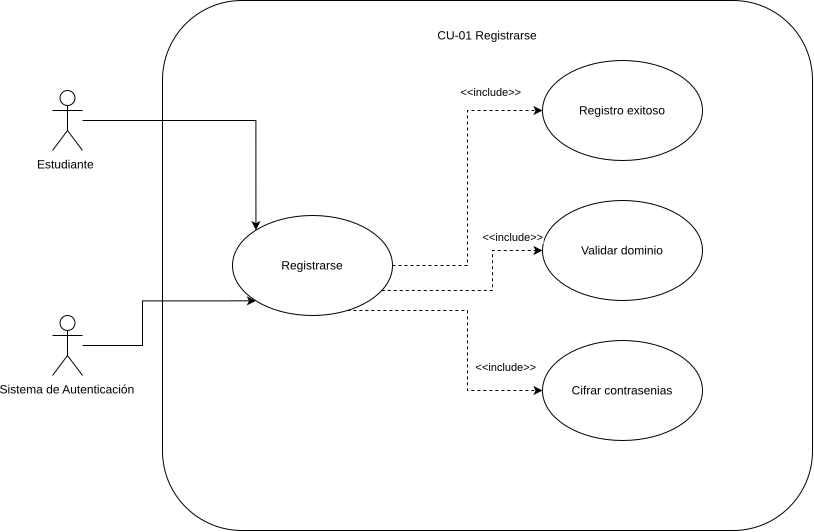

---

## CU-02: Iniciar Sesión

| Campo | Detalle |
|-------|---------|
| **ID** | CU-02 |
| **Nombre** | Iniciar sesión |
| **Actor principal** | Estudiante, Docente, Administrador |
| **Actor secundario** | Sistema de Autenticación |
| **Precondición** | El usuario tiene una cuenta registrada y activa en el sistema |
| **Postcondición** | El usuario obtiene un token JWT válido y accede a la plataforma según su rol |

### Flujo Principal
1. El usuario accede a la pantalla de inicio de sesión.
2. El usuario ingresa su correo institucional y contraseña.
3. El sistema valida que el correo pertenezca al dominio institucional.
4. El sistema verifica que la cuenta no esté bloqueada.
5. El sistema compara la contraseña ingresada con el hash almacenado.
6. El sistema genera un token JWT con expiración de 8 horas y los datos del rol del usuario.
7. El sistema redirige al usuario a la pantalla principal según su rol.

### Flujos Alternativos
- **FA-01 — Usuario ya tiene sesión activa:** Si el usuario accede con un JWT válido aún vigente, el sistema redirige directamente a la pantalla principal sin solicitar credenciales nuevamente.

### Flujos de Excepción
- **FE-01 — Credenciales incorrectas:** En el paso 5, si la contraseña no coincide, el sistema incrementa el contador de intentos fallidos, muestra "Correo o contraseña incorrectos" y no especifica cuál de los dos es incorrecto.
- **FE-02 — Cuenta bloqueada:** En el paso 4, si la cuenta está bloqueada por exceder 5 intentos fallidos, el sistema muestra "Cuenta bloqueada temporalmente, revise su correo institucional".
- **FE-03 — Dominio inválido:** En el paso 3, si el correo no pertenece al dominio institucional, el sistema rechaza el intento sin consultar la base de datos.

### Diagrama local

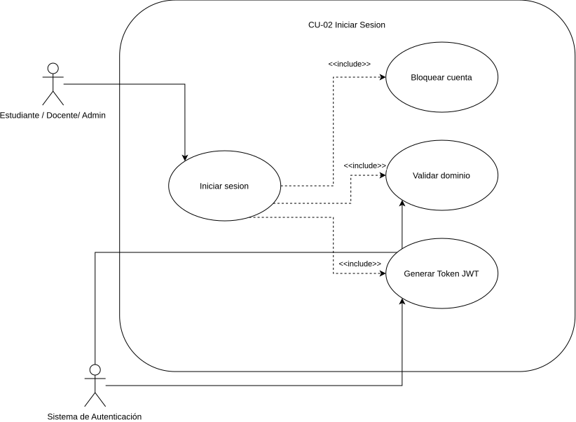

---

## CU-03: Recuperar Contraseña

| Campo | Detalle |
|-------|---------|
| **ID** | CU-03 |
| **Nombre** | Recuperar contraseña |
| **Actor principal** | Estudiante, Docente |
| **Actor secundario** | Sistema de Autenticación |
| **Precondición** | El usuario tiene una cuenta registrada con un correo institucional válido |
| **Postcondición** | El usuario recibe un enlace temporal para restablecer su contraseña |

### Flujo Principal
1. El usuario accede a la opción "Olvidé mi contraseña" en la pantalla de inicio de sesión.
2. El usuario ingresa su correo institucional.
3. El sistema valida que el correo pertenezca al dominio institucional.
4. El sistema verifica que el correo esté registrado en la base de datos.
5. El sistema genera un token de recuperación de un solo uso con expiración de 30 minutos.
6. El sistema envía un correo al usuario con el enlace de recuperación.
7. El usuario accede al enlace y establece una nueva contraseña.
8. El sistema cifra y actualiza la contraseña, invalidando el token de recuperación.
9. El sistema redirige al usuario a la pantalla de inicio de sesión.

### Flujos Alternativos
- **FA-01 — El usuario recuerda su contraseña:** En cualquier paso, el usuario puede regresar a la pantalla de inicio de sesión sin completar el flujo.

### Flujos de Excepción
- **FE-01 — Correo no registrado:** En el paso 4, si el correo no existe en la base de datos, el sistema muestra el mismo mensaje de éxito por seguridad ("Si el correo está registrado, recibirá un enlace") sin revelar si existe o no.
- **FE-02 — Token expirado:** Si el usuario accede al enlace después de 30 minutos, el sistema muestra "El enlace ha expirado, solicite uno nuevo".
- **FE-03 — Dominio inválido:** En el paso 3, el sistema rechaza el intento si el correo no pertenece al dominio institucional.

### Diagrama local

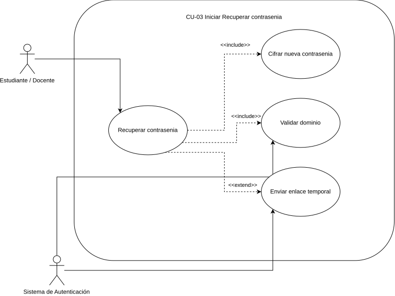

---

## CU-04: Ver Catálogo

| Campo | Detalle |
|-------|---------|
| **ID** | CU-04 |
| **Nombre** | Ver catálogo |
| **Actor principal** | Estudiante, Docente, Administrador |
| **Precondición** | El usuario tiene una sesión activa con token JWT válido |
| **Postcondición** | El usuario visualiza el listado paginado de grabaciones disponibles según su rol |

### Flujo Principal
1. El usuario autenticado accede a la sección de catálogo.
2. El sistema valida el token JWT del usuario.
3. El sistema identifica el rol del usuario.
4. Si el usuario es Estudiante, el sistema filtra las grabaciones según los cursos en los que está inscrito.
5. Si el usuario es Docente o Administrador, el sistema carga el catálogo completo.
6. El sistema muestra las grabaciones paginadas (20 por página) con miniatura, título, catedrático, curso, duración y porcentaje de recomendación.
7. El usuario puede navegar entre páginas del catálogo.

### Flujos Alternativos
- **FA-01 — El estudiante no tiene cursos inscritos:** En el paso 4, si el estudiante no tiene ningún curso inscrito, el sistema muestra el mensaje "No tienes cursos inscritos aún. Contacta al administrador".
- **FA-02 — El usuario aplica filtros:** Desde el catálogo, el usuario puede iniciar el flujo CU-05 para refinar los resultados.

### Flujos de Excepción
- **FE-01 — Token expirado:** En el paso 2, si el token JWT ha expirado, el sistema redirige al usuario a la pantalla de inicio de sesión.
- **FE-02 — Sin grabaciones disponibles:** Si no hay grabaciones publicadas para los cursos del estudiante, el sistema muestra "No hay grabaciones disponibles por el momento".

### Diagrama local

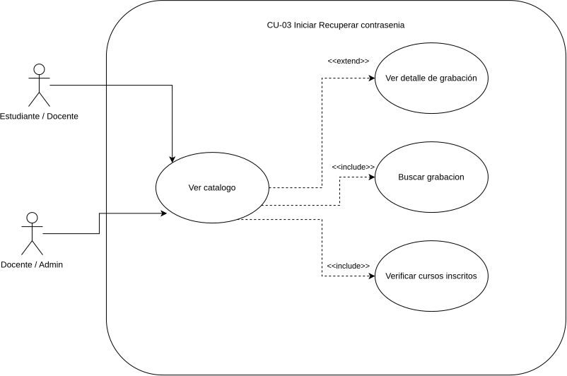

---

## CU-05: Buscar y Filtrar Grabaciones

| Campo | Detalle |
|-------|---------|
| **ID** | CU-05 |
| **Nombre** | Buscar y filtrar grabaciones |
| **Actor principal** | Estudiante, Docente, Administrador |
| **Precondición** | El usuario tiene sesión activa y se encuentra en la pantalla del catálogo |
| **Postcondición** | El sistema muestra los resultados que coinciden con los criterios de búsqueda aplicados |

### Flujo Principal
1. El usuario accede al panel de búsqueda y filtros en el catálogo.
2. El usuario ingresa un término de búsqueda en el campo de texto libre y/o selecciona uno o más filtros (semestre/año, escuela, curso, catedrático).
3. El sistema ejecuta la consulta combinando los criterios ingresados.
4. El sistema aplica la restricción de cursos inscritos si el actor es Estudiante.
5. El sistema muestra los resultados paginados ordenados por relevancia por defecto.
6. El usuario puede cambiar el criterio de ordenamiento (fecha de publicación, calificación promedio).

### Flujos Alternativos
- **FA-01 — El usuario limpia los filtros:** El usuario puede restablecer todos los filtros para volver al catálogo completo.
- **FA-02 — El usuario aplica solo filtros sin texto:** El sistema ejecuta la búsqueda usando únicamente los filtros seleccionados.

### Flujos de Excepción
- **FE-01 — Sin resultados:** Si ninguna grabación coincide con los criterios, el sistema muestra "No se encontraron grabaciones con los filtros aplicados" y sugiere ampliar la búsqueda.
- **FE-02 — Error en la consulta:** Si el servicio de catálogo no responde, el sistema muestra "Error al cargar resultados, intente nuevamente".

### Diagrama local

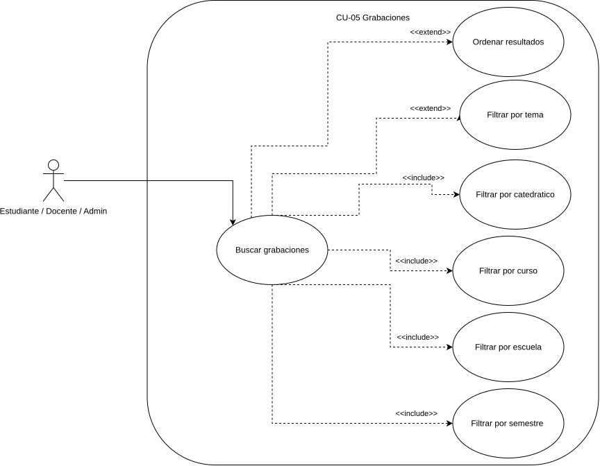

---

## CU-06: Reproducir Video

| Campo | Detalle |
|-------|---------|
| **ID** | CU-06 |
| **Nombre** | Reproducir video |
| **Actor principal** | Estudiante, Docente |
| **Precondición** | El usuario tiene sesión activa y selecciona una grabación a la que tiene acceso |
| **Postcondición** | El video se reproduce desde el último checkpoint registrado o desde el inicio si es la primera vez |

### Flujo Principal
1. El usuario selecciona una grabación del catálogo.
2. El sistema verifica que el usuario tenga acceso al curso al que pertenece la grabación.
3. El sistema consulta si existe un checkpoint previo del usuario para esa grabación.
4. Si existe checkpoint, el sistema carga el video desde esa posición.
5. Si no existe checkpoint, el sistema inicia el video desde el principio.
6. El video comienza a reproducirse en el reproductor embebido de la plataforma.
7. El sistema inicia el registro automático de checkpoints cada 30 segundos.

### Flujos Alternativos
- **FA-01 — El usuario cambia la resolución:** Durante la reproducción, el usuario puede seleccionar entre 720p y 1080p sin interrumpir el checkpoint activo.
- **FA-02 — El usuario pausa y reanuda:** El sistema registra el checkpoint en el momento de la pausa y reanuda desde esa posición.

### Flujos de Excepción
- **FE-01 — Sin acceso al curso:** En el paso 2, si el estudiante no está inscrito en el curso de la grabación, el sistema muestra "No tienes acceso a esta grabación" y redirige al catálogo.
- **FE-02 — Error de carga del video:** Si el servicio de streaming no responde, el sistema muestra "Error al cargar el video, intente más tarde".
- **FE-03 — Sesión expirada durante reproducción:** Si el JWT expira mientras el usuario reproduce el video, el sistema guarda el checkpoint actual y redirige al login.

### Diagrama local

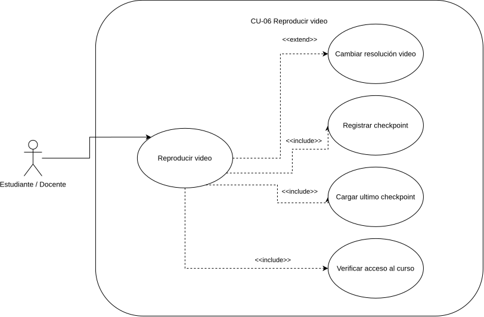

---

## CU-07: Registrar Checkpoint

| Campo | Detalle |
|-------|---------|
| **ID** | CU-07 |
| **Nombre** | Registrar checkpoint |
| **Actor principal** | Estudiante, Docente |
| **Precondición** | El usuario está reproduciendo activamente un video |
| **Postcondición** | La posición de reproducción queda guardada en la base de datos y el porcentaje de avance se actualiza |

### Flujo Principal
1. El sistema detecta que han transcurrido 30 segundos desde el último checkpoint registrado.
2. El sistema captura la posición actual de reproducción en segundos.
3. El sistema calcula el porcentaje de avance sobre la duración total del video.
4. El sistema guarda el checkpoint en la base de datos asociado al usuario y al video.
5. El sistema confirma el guardado antes de responder al cliente.
6. El sistema actualiza el indicador de avance visible en el reproductor.

### Flujos Alternativos
- **FA-01 — El usuario llega al final del video:** El sistema registra el checkpoint en la posición final y marca el video como completado (100% de avance).
- **FA-02 — El usuario pausa el video manualmente:** El sistema registra inmediatamente el checkpoint en la posición de pausa sin esperar los 30 segundos.

### Flujos de Excepción
- **FE-01 — Error al guardar checkpoint:** Si la base de datos no responde, el sistema reintenta el guardado hasta 3 veces antes de registrar el error en el log sin interrumpir la reproducción.
- **FE-02 — Pérdida de conexión:** Si el usuario pierde conectividad, el sistema almacena el checkpoint localmente en el navegador y lo sincroniza al restaurar la conexión.

### Diagrama local

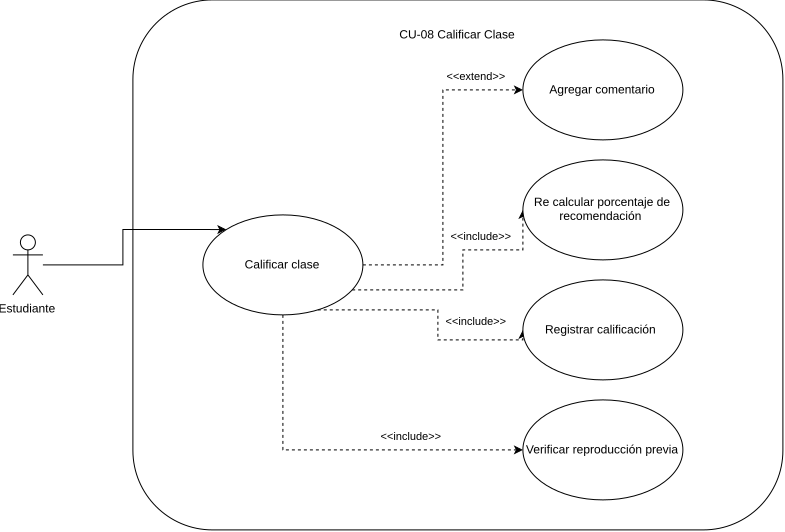

---

## CU-08: Calificar Clase

| Campo | Detalle |
|-------|---------|
| **ID** | CU-08 |
| **Nombre** | Calificar clase |
| **Actor principal** | Estudiante |
| **Precondición** | El estudiante ha reproducido al menos una vez la grabación que desea calificar |
| **Postcondición** | La calificación queda registrada y el porcentaje de recomendación del video se recalcula dinámicamente |

### Flujo Principal
1. El estudiante accede a la opción de calificar desde el reproductor o desde el catálogo.
2. El sistema verifica que el estudiante haya reproducido previamente la grabación.
3. El sistema muestra el componente de calificación de 1 a 5 estrellas.
4. El estudiante selecciona una puntuación.
5. El sistema registra la calificación asociada al usuario y al video.
6. El sistema recalcula el porcentaje de recomendación del video.
7. El sistema actualiza el porcentaje de recomendación visible en el catálogo y el reproductor.

### Flujos Alternativos
- **FA-01 — El estudiante agrega un comentario:** En el paso 4, el estudiante puede opcionalmente escribir una reseña que se guarda junto a la calificación.
- **FA-02 — El estudiante modifica su calificación:** Si el estudiante ya calificó el video anteriormente, el sistema actualiza la calificación existente en lugar de crear una nueva.

### Flujos de Excepción
- **FE-01 — Estudiante no ha reproducido el video:** En el paso 2, si no existe historial de reproducción, el sistema muestra "Debes ver la clase antes de calificarla".
- **FE-02 — Error al guardar calificación:** Si el servicio falla, el sistema muestra "No se pudo guardar tu calificación, intenta nuevamente" sin actualizar el porcentaje de recomendación.

### Diagrama local

---

## CU-09: Inscribir Estudiante en Curso

| Campo | Detalle |
|-------|---------|
| **ID** | CU-09 |
| **Nombre** | Inscribir estudiante en curso |
| **Actor principal** | Administrador |
| **Precondición** | Existe al menos un usuario con rol Estudiante y al menos un curso registrado en el sistema |
| **Postcondición** | El estudiante queda inscrito en el curso y puede acceder a sus grabaciones |

### Flujo Principal
1. El Administrador accede al panel de gestión de inscripciones.
2. El Administrador busca y selecciona al estudiante que desea inscribir.
3. El sistema verifica que el usuario seleccionado tenga rol Estudiante.
4. El Administrador selecciona el curso en el que desea inscribir al estudiante.
5. El sistema verifica que el estudiante no esté ya inscrito en ese curso.
6. El sistema registra la inscripción en la base de datos.
7. El sistema envía una notificación al estudiante informando su nueva inscripción.

### Flujos Alternativos
- **FA-01 — Inscripción múltiple:** El Administrador puede seleccionar varios cursos y registrar todas las inscripciones del mismo estudiante en una sola operación.

### Flujos de Excepción
- **FE-01 — Usuario sin rol Estudiante:** En el paso 3, si el usuario seleccionado es Docente o Administrador, el sistema muestra "Este usuario no tiene rol de Estudiante" y cancela la inscripción.
- **FE-02 — Estudiante ya inscrito:** En el paso 5, si el estudiante ya está inscrito en el curso seleccionado, el sistema muestra "El estudiante ya está inscrito en este curso".
- **FE-03 — Error al registrar:** Si la base de datos falla, el sistema muestra "Error al registrar la inscripción, intente nuevamente" sin guardar datos parciales.

### Diagrama local

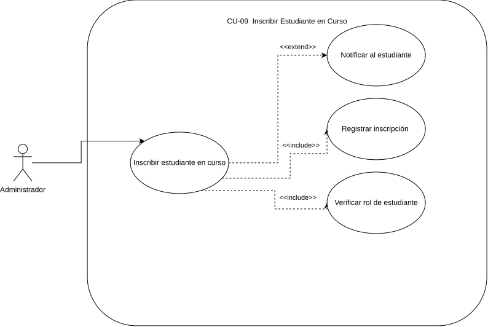

---

## CU-10: Subir Grabación

| Campo | Detalle |
|-------|---------|
| **ID** | CU-10 |
| **Nombre** | Subir grabación |
| **Actor principal** | Docente |
| **Precondición** | El Docente tiene sesión activa y es catedrático de al menos un curso registrado |
| **Postcondición** | La grabación queda publicada y disponible en el catálogo para los estudiantes inscritos en el curso |

### Flujo Principal
1. El Docente accede al panel de gestión de sus grabaciones.
2. El Docente selecciona la opción de subir nueva grabación.
3. El sistema muestra el formulario de carga con campos: título, descripción, curso, semestre, temas/etiquetas y archivo de video.
4. El Docente completa el formulario y selecciona el archivo de video.
5. El sistema verifica que el Docente sea catedrático del curso seleccionado.
6. El sistema valida el formato y tamaño del archivo de video.
7. El sistema procesa y almacena el video.
8. El sistema asocia la grabación al curso con los metadatos ingresados.
9. El sistema notifica a los estudiantes inscritos en el curso sobre la nueva grabación disponible.

### Flujos Alternativos
- **FA-01 — El Docente guarda como borrador:** El Docente puede guardar la grabación como borrador sin publicarla aún en el catálogo.

### Flujos de Excepción
- **FE-01 — Docente sin cátedra en el curso:** En el paso 5, si el Docente no es catedrático del curso seleccionado, el sistema muestra "No tienes permisos para publicar en este curso".
- **FE-02 — Formato de video inválido:** En el paso 6, si el archivo no cumple con el formato aceptado, el sistema muestra los formatos permitidos y cancela la carga.
- **FE-03 — Error durante la carga:** Si el proceso de almacenamiento falla, el sistema informa al Docente y no registra la grabación de forma parcial.

### Diagrama local

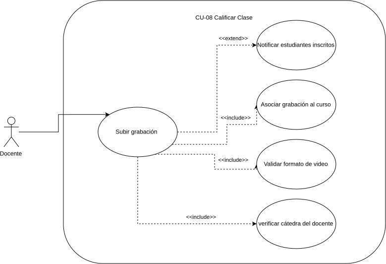

---

## CU-11: Asignar Rol a Usuario

| Campo | Detalle |
|-------|---------|
| **ID** | CU-11 |
| **Nombre** | Asignar rol a usuario |
| **Actor principal** | Administrador |
| **Precondición** | El usuario al que se le asignará el rol está registrado en el sistema |
| **Postcondición** | El usuario tiene el nuevo rol asignado y sus permisos se actualizan en el siguiente inicio de sesión |

### Flujo Principal
1. El Administrador accede al panel de gestión de usuarios.
2. El Administrador busca y selecciona al usuario al que desea modificar el rol.
3. El sistema muestra el perfil del usuario con su rol actual.
4. El Administrador selecciona el nuevo rol (Estudiante, Docente o Administrador).
5. El sistema solicita confirmación de la acción.
6. El Administrador confirma el cambio.
7. El sistema actualiza el rol del usuario en la base de datos.
8. El sistema registra la acción en el log de auditoría.

### Flujos Alternativos
- **FA-01 — El Administrador revoca un rol:** En el paso 4, el Administrador puede revocar el rol actual y reasignar el rol base de Estudiante.

### Flujos de Excepción
- **FE-01 — El Administrador intenta modificar su propio rol:** El sistema muestra "No puedes modificar tu propio rol" y cancela la operación para evitar que el sistema quede sin administradores.
- **FE-02 — Error al actualizar:** Si la base de datos falla al actualizar, el sistema muestra "No se pudo actualizar el rol, intente nuevamente" y mantiene el rol anterior.

### Diagrama local

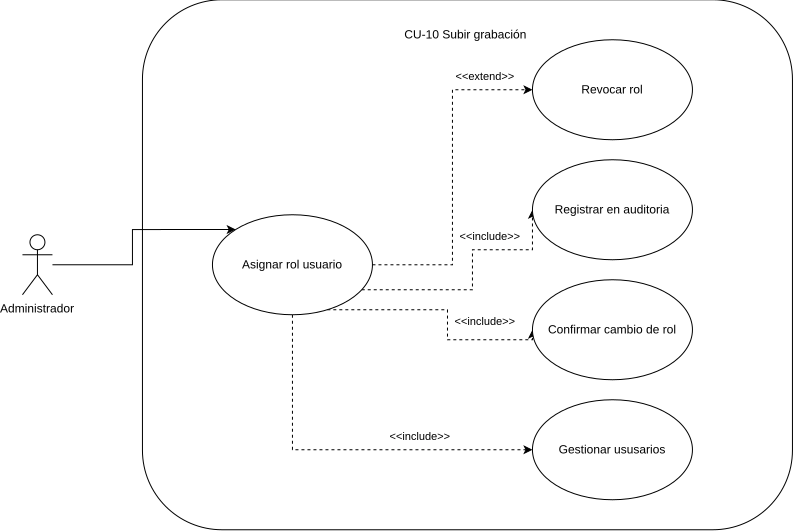

---

## CU-12: Ver Mis Cursos Inscritos

| Campo | Detalle |
|-------|---------|
| **ID** | CU-12 |
| **Nombre** | Ver mis cursos inscritos |
| **Actor principal** | Estudiante |
| **Precondición** | El estudiante tiene sesión activa y está inscrito en al menos un curso |
| **Postcondición** | El estudiante visualiza sus cursos con el estado de avance actualizado por cada uno |

### Flujo Principal
1. El estudiante accede a la sección "Mis cursos" desde el menú principal.
2. El sistema consulta los cursos en los que el estudiante está inscrito.
3. El sistema consulta el avance del estudiante en cada curso (promedio de checkpoints de sus grabaciones).
4. El sistema muestra el listado de cursos con: nombre del curso, catedrático, semestre y porcentaje de avance global.
5. El estudiante puede seleccionar un curso para ver las grabaciones disponibles y su avance individual por grabación.

### Flujos Alternativos
- **FA-01 — El estudiante accede al detalle de un curso:** En el paso 5, al seleccionar un curso, el sistema muestra la lista de grabaciones del curso con el avance individual de cada una y acceso directo al reproductor.

### Flujos de Excepción
- **FE-01 — Sin cursos inscritos:** En el paso 2, si el estudiante no tiene inscripciones, el sistema muestra "No tienes cursos inscritos. Contacta al administrador para gestionar tus inscripciones".
- **FE-02 — Error al cargar el avance:** Si el servicio de checkpoints no responde, el sistema muestra los cursos pero indica "Avance no disponible temporalmente" en lugar de bloquear la vista completa.

### Diagrama local

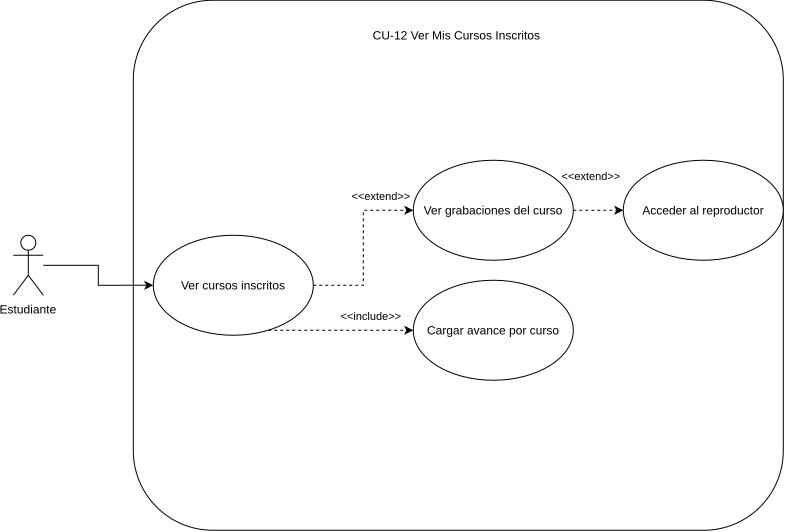