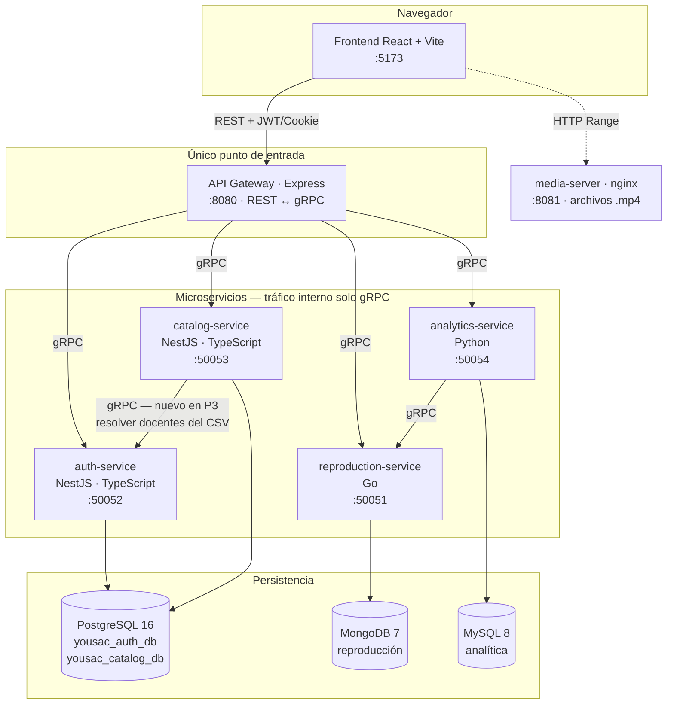
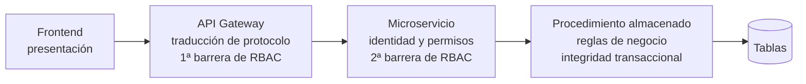
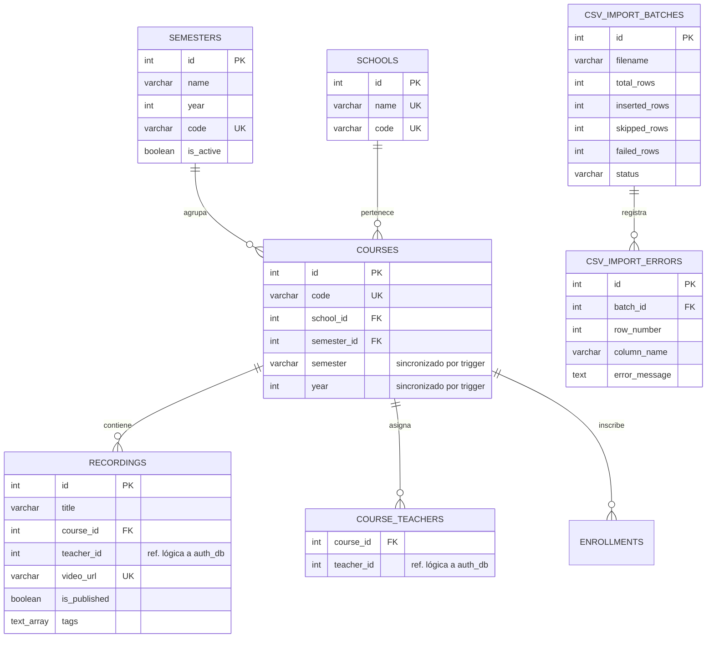
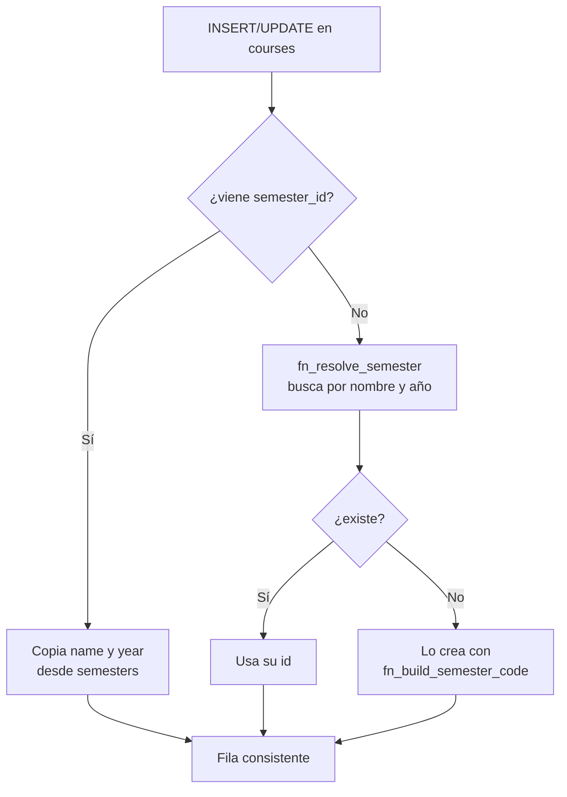
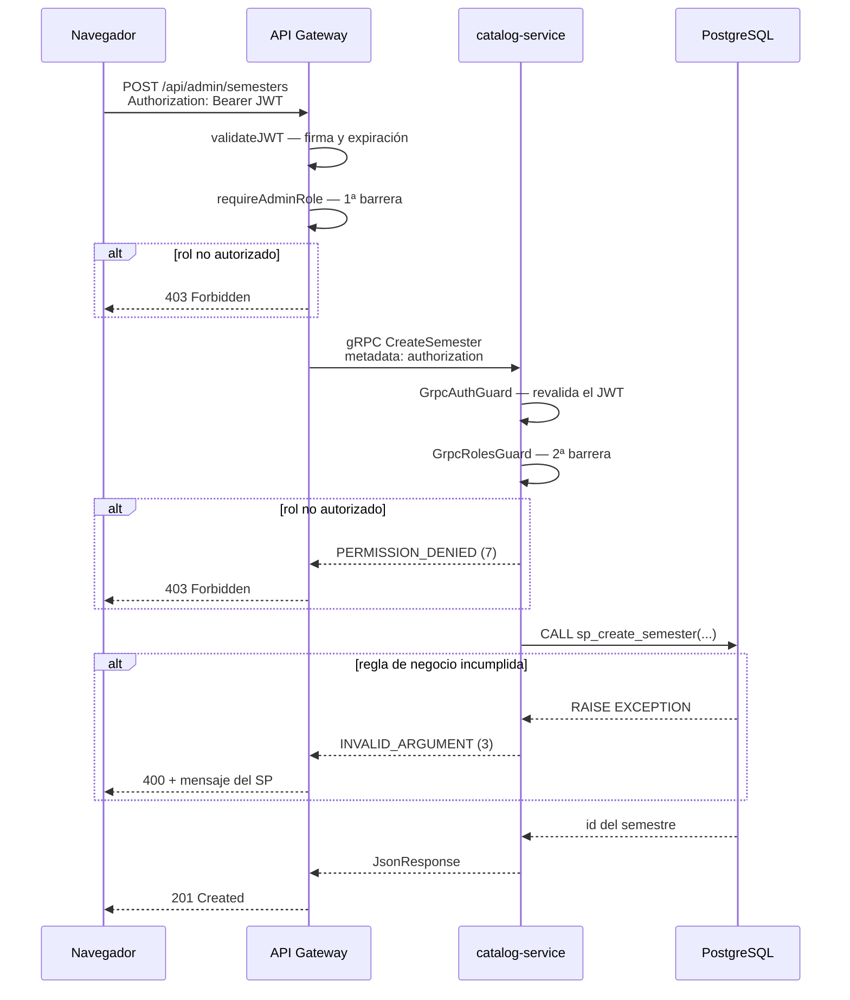
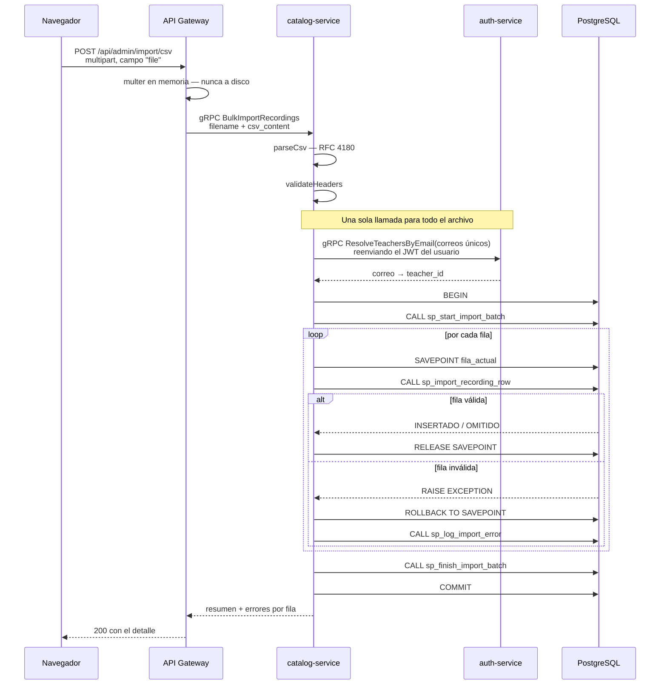
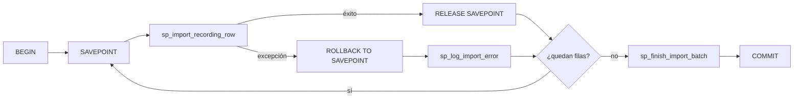
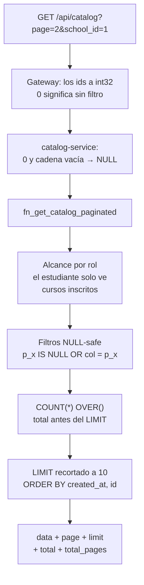
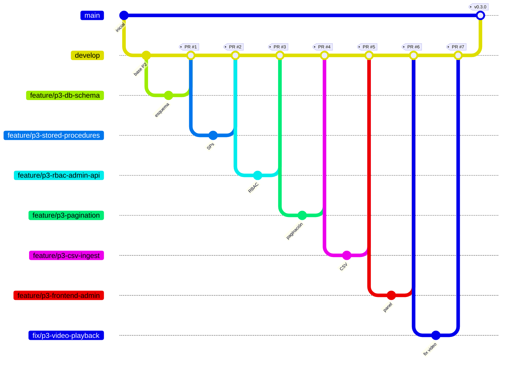

# Práctica 3 — Panel de administración, carga masiva y transacciones en base de datos

**Universidad de San Carlos de Guatemala**
Facultad de Ingeniería · Escuela de Ingeniería en Ciencias y Sistemas
Curso: Software Avanzado · Segundo Semestre 2026

| | |
|---|---|
| **Estudiante** | Diego González |
| **Carné** | 202300449 |
| **Proyecto** | YoUSAC — Plataforma de video académico |
| **Versión** | `v0.3.0` |
| **Repositorio** | https://github.com/Di3go004/SA_PROYECTO_202300449- |

---

## Índice

1. [Introducción](#1-introducción)
2. [Alcance implementado](#2-alcance-implementado)
3. [Arquitectura del sistema](#3-arquitectura-del-sistema)
4. [Modelo de datos](#4-modelo-de-datos)
5. [Panel administrativo y RBAC](#5-panel-administrativo-y-rbac)
6. [Ingesta masiva mediante CSV](#6-ingesta-masiva-mediante-csv)
7. [Paginación desde servidor](#7-paginación-desde-servidor)
8. [Procedimientos almacenados](#8-procedimientos-almacenados)
9. [Orquestación local con Docker Compose](#9-orquestación-local-con-docker-compose)
10. [Flujo de trabajo en Git](#10-flujo-de-trabajo-en-git)
11. [Evidencias de funcionamiento](#11-evidencias-de-funcionamiento)
12. [Problemas encontrados y decisiones tomadas](#12-problemas-encontrados-y-decisiones-tomadas)
13. [Conclusiones](#13-conclusiones)

---

## 1. Introducción

Las dos prácticas anteriores dejaron consolidado el núcleo de YoUSAC: autenticación institucional con JWT y cookies de sesión, comunicación interna exclusivamente por gRPC sobre HTTP/2, y reproducción de video con checkpoints de tiempo. Sobre esa base, esta tercera entrega habilita las herramientas de gestión que necesitan los roles administrativos y docentes.

El trabajo se organizó en torno a cuatro capacidades:

- Un **panel web de administración** protegido por control de acceso basado en roles, desde el cual se administran semestres, escuelas, cursos y docentes.
- Un **módulo de ingesta masiva** que procesa archivos `.csv` con grabaciones de semestres anteriores.
- **Paginación resuelta en el servidor**, con un máximo de diez clases por página que se mantiene al combinar filtros.
- **Procedimientos almacenados** que concentran toda la escritura compleja: las inserciones del CSV y las asignaciones académicas.

Todo el ecosistema se levanta y se prueba localmente con `docker-compose.local.yml`.

Un criterio atraviesa el documento entero y conviene enunciarlo desde el principio: **las reglas de negocio de escritura viven en la base de datos, no en el código de los microservicios**. El servicio valida identidad y permisos, arma la llamada e interpreta el resultado; qué constituye un dato válido lo decide el procedimiento almacenado. Esa decisión explica buena parte de las secciones que siguen.

---

## 2. Alcance implementado

| Requisito de la práctica | Estado | Dónde se resuelve |
|---|---|---|
| Panel administrativo protegido por rol | Completo | `frontend/src/pages/AdminPage.tsx` y `pages/admin/` |
| CRUD de Semestres | Completo | `sp_create/update/delete_semester` |
| CRUD de Escuelas/Áreas | Completo | `sp_create/update/delete_school` |
| CRUD de Cursos | Completo | `sp_create/update/delete_course` |
| Gestión de Docentes y asignaciones | Completo | `sp_assign_teacher_to_course`, `sp_unassign_teacher_from_course` |
| RBAC Admin / Catedrático / Auxiliar | Completo | Gateway + `GrpcRolesGuard` en cada microservicio |
| Ingesta masiva CSV | Completo | `catalog-service/src/import/` |
| Paginación ≤ 10 por página | Completo | `fn_get_catalog_paginated` |
| Filtros combinados con paginación activa | Completo | Semestre, escuela, curso, docente, año, etiqueta y búsqueda |
| SPs para CSV y asignaciones | Completo | `DB/practica3_sps.sql` |
| Tráfico interno solo gRPC | Completo | Sin REST entre servicios; `.proto` en `/proto` |
| Sin ORM ni BaaS | Completo | `pg` con SQL explícito |
| `docker-compose.local.yml` | Completo | 10 servicios |
| Pull Requests | Completo | 8 PRs aprobados y fusionados |
| Tag `v0.3.0` | Completo | Ver sección 10 |

**Totales de la entrega:** 20 procedimientos almacenados, 10 funciones, 7 vistas y 4 triggers en la base del catálogo; 25 RPC en `catalog.proto` y 10 en `auth.proto`; 21 rutas REST bajo `/api/admin`.

---

## 3. Arquitectura del sistema

### 3.1 Vista de componentes

El navegador solo conoce al API Gateway. El gateway traduce REST a gRPC y ningún microservicio expone REST hacia otro: el único HTTP que conservan es su endpoint `/health`.



La novedad arquitectónica de esta práctica es la flecha `catalog-service → auth-service`. Hasta ahora todo el tráfico nacía en el gateway; la carga masiva obligó a que dos microservicios conversen directamente, y se resolvió por gRPC como exige la restricción del curso. La sección 6.3 explica el motivo.

### 3.2 Separación de responsabilidades por capa



Cada capa asume una responsabilidad y desconfía de la anterior. El frontend oculta lo que el usuario no puede usar, pero no autoriza; el gateway filtra por rol, pero el microservicio vuelve a verificarlo; el microservicio arma la llamada, pero el procedimiento decide si el dato es admisible.

---

## 4. Modelo de datos

### 4.1 Esquema del catálogo



### 4.2 Semestres: normalizar sin romper lo existente

Antes de esta práctica, «semestre» no era una entidad: era la columna `VARCHAR courses.semester`. No se podía administrar ni referenciar, de modo que el requisito de gestionar semestres obligaba a normalizarlo.

La migración directa —crear `semesters`, apuntar la FK y borrar las columnas viejas— habría obligado a reescribir las cuatro vistas del catálogo y todas las consultas que filtraban por nombre de semestre. Se optó por una vía intermedia:

- Se creó la tabla `semesters` y la FK `courses.semester_id`.
- **Las columnas `semester` y `year` se conservaron**, y un trigger las mantiene sincronizadas con la fila de `semesters`.

`trg_courses_sync_semester` funciona en las dos direcciones:



Esto produjo tres beneficios concretos:

1. Ninguna vista ni consulta preexistente necesitó modificarse.
2. El CSV puede traer semestres que aún no existen: se crean sobre la marcha.
3. `trg_semesters_propagate` evita que renombrar un semestre deje cursos con el nombre antiguo.

---

## 5. Panel administrativo y RBAC

### 5.1 Roles

El rol `docente` pasó a llamarse `catedratico` **conservando su id 3**, para no invalidar los identificadores que el panel ya usaba al asignar roles, y se añadió `auxiliar` con id 4.

| id | Rol | Panel administrativo | Gestión de usuarios |
|---|---|---|---|
| 1 | `administrador` | Sí | Sí |
| 3 | `catedratico` | Sí | No |
| 4 | `auxiliar` | Sí | No |
| 2 | `estudiante` | No | No |

Usuarios de prueba sembrados por `DB/auth_db.sql`, todos con contraseña `Yousac2026!`:

`admin@ingenieria.usac.edu.gt` · `catedratico@ingenieria.usac.edu.gt` · `auxiliar@ingenieria.usac.edu.gt` · `estudiante@ingenieria.usac.edu.gt`

### 5.2 Autorización en dos barreras



La doble validación no es redundancia decorativa. Los puertos gRPC de los microservicios están publicados en el compose, de modo que cualquier proceso de la red puede dirigirse a `catalog-service:50053` sin pasar por el gateway. Se comprobó exactamente ese escenario, y el microservicio rechaza por su cuenta (sección 11.2).

### 5.3 Secciones del panel

| Sección | Contenido |
|---|---|
| Resumen | Conteos por entidad y aviso de cursos sin docente |
| Semestres | CRUD; solo un semestre activo a la vez |
| Escuelas | CRUD por nombre y código |
| Cursos | CRUD, filtros por escuela y semestre, asignación de docentes |
| Docentes | Catedráticos y auxiliares registrados |
| Usuarios | Roles y bloqueo — exclusivo del administrador |
| Carga CSV | Subida, resultado por lote e historial |

---

## 6. Ingesta masiva mediante CSV

### 6.1 Recorrido completo



### 6.2 Estrategia transaccional: un SAVEPOINT por fila

Es la decisión técnica central del módulo. Todo el lote corre dentro de **una transacción**, pero cada fila se protege con su propio `SAVEPOINT`.

El motivo es concreto. Los procedimientos comunican los errores de negocio con `RAISE EXCEPTION`, y en PostgreSQL una excepción deja la transacción **entera** en estado abortado:

```
current transaction is aborted, commands ignored until end of transaction block
```

Sin `SAVEPOINT`, la primera fila inválida invalidaría todas las siguientes y se perdería el lote completo. Con `SAVEPOINT` se revierte únicamente esa fila, se registra el error y el proceso continúa; al final un solo `COMMIT` publica todo lo que sí entró.



`withTransaction()` se añadió a `CatalogDatabaseService` porque `query()` toma una conexión distinta del *pool* en cada llamada: un `BEGIN` por un lado y un `COMMIT` por otro caerían en conexiones diferentes y la transacción no existiría.

### 6.3 Por qué catalog-service llama a auth-service

El CSV identifica al docente por **correo**, pero las grabaciones se almacenan con `teacher_id`, y los usuarios viven en `yousac_auth_db` — una base a la que `catalog-service` no tiene, ni debe tener, acceso directo. La alternativa habría sido que el CSV trajera identificadores numéricos, lo que resulta impracticable para un archivo que edita una persona.

Dos decisiones al respecto:

- **Se reenvía el JWT del usuario que subió el archivo.** La llamada entre microservicios no viaja anónima ni con credenciales de servicio: `auth-service` le aplica el mismo RBAC que a cualquier otro consumidor.
- **`ResolveTeachersByEmail` solo devuelve usuarios que ya son catedrático o auxiliar.** Un CSV no puede crear cuentas ni ascender a nadie. Se verificó colocando un estudiante como docente en el archivo de prueba: la fila fue rechazada.

### 6.4 Formato del archivo

| Columna | Obligatoria | Observaciones |
|---|---|---|
| `school_code` | Sí | Si no existe, se crea usando `school_name` |
| `school_name` | No | Obligatoria solo si hay que crear la escuela |
| `course_code` | Sí | Si no existe, se crea usando `course_name` |
| `course_name` | No | Obligatoria solo si hay que crear el curso |
| `semester_name` | Sí | Se crea si no existe |
| `year` | Sí | Entre 2000 y 2100 |
| `teacher_email` | Sí | Debe ser un catedrático o auxiliar registrado |
| `title` | Sí | |
| `description` | No | Admite comas si va entre comillas |
| `duration_seconds` | No | Vacío equivale a 0 |
| `video_url` | Sí | Clave de idempotencia |
| `thumbnail_url` | No | |
| `tags` | No | Separadas por `\|` |
| `is_published` | No | Vacío equivale a `true` |

Archivos de ejemplo en `DB/samples/`: uno limpio de 12 filas y otro con errores deliberados.

### 6.5 Orden de resolución

`sp_import_recording_row` resuelve en cascada **escuela → semestre → curso → asignación docente** y solo entonces inserta la grabación. El orden no es cosmético: el trigger `trg_validate_teacher_course`, heredado de la práctica anterior, rechaza toda grabación cuyo docente no esté previamente asignado al curso. Insertar antes de asignar habría hecho fallar todas las filas del archivo.

### 6.6 Idempotencia

La grabación se omite si su `video_url` ya existe, respaldado por un índice único. Reprocesar el mismo archivo no duplica nada: suma filas en el contador de omitidas. Esto permite repetir la demostración cuantas veces sea necesario.

### 6.7 Parser propio

`split(',')` no es suficiente: los campos entrecomillados pueden contener comas, saltos de línea y comillas escapadas (`""`), y las descripciones de las grabaciones las traen. Se implementó un autómata conforme a RFC 4180 que además descarta el BOM que Excel escribe al inicio de los `.csv` —sin eliminarlo, el primer encabezado queda como `school_code` y ninguna columna coincide—.

Se escribió a mano en lugar de añadir una dependencia porque el parseo forma parte de lo que la práctica evalúa y porque el `Dockerfile` instala con `--frozen-lockfile`.

---

## 7. Paginación desde servidor

### 7.1 Diseño

`fn_get_catalog_paginated` devuelve **la página y el total en una sola consulta**, mediante `COUNT(*) OVER()`, que se evalúa después del `WHERE` y antes del `LIMIT`.



Se prefirió una función única sobre dos —una de datos y otra de conteo— porque duplicar el predicado invita a que ambas versiones diverjan con el tiempo.

### 7.2 El tope de diez lo impone la base

```sql
v_limit := LEAST(GREATEST(COALESCE(p_limit, 10), 1), 10);
```

El recorte ocurre **dentro de la función**, no en el microservicio. Solicitar `limit=500` devuelve diez resultados igualmente: el cumplimiento del requisito no depende de que el cliente se comporte correctamente.

### 7.3 Filtros combinables

Cada filtro es NULL-safe (`p_x IS NULL OR columna = p_x`), de modo que se combinan sin construir SQL por concatenación y sin superficie de inyección. Están disponibles: semestre por id, semestre por nombre, escuela, curso, docente, año, etiqueta y búsqueda de texto.

Hay dos filtros de semestre y no son redundantes: el id apunta a un periodo concreto («Primer Semestre 2025») mientras que el nombre agrupa el mismo periodo de todos los años. El panel usa el id; el catálogo del estudiante, el nombre.

### 7.4 Orden determinista

El `ORDER BY` desempata por `recording_id`. Sin ese desempate, dos grabaciones con idéntico `created_at` podrían intercambiar posiciones entre consultas y aparecer duplicadas en una página y ausentes en otra. Se verificó que las tres páginas devuelven 24 identificadores únicos sin solapamiento.

---

## 8. Procedimientos almacenados

Archivo entregable: **`DB/practica3_sps.sql`**, montado en el compose como `03_practica3_sps.sql` para que se ejecute después de las tablas.

### 8.1 Inventario

| Categoría | Procedimientos |
|---|---|
| Semestres | `sp_create_semester`, `sp_update_semester`, `sp_delete_semester` |
| Escuelas | `sp_create_school`, `sp_update_school`, `sp_delete_school` |
| Cursos | `sp_create_course`, `sp_update_course`, `sp_delete_course` |
| Asignaciones | `sp_assign_teacher_to_course`, `sp_ensure_teacher_assignment`, `sp_unassign_teacher_from_course` |
| Ingesta CSV | `sp_start_import_batch`, `sp_import_recording_row`, `sp_log_import_error`, `sp_finish_import_batch` |
| Funciones de apoyo | `fn_get_catalog_paginated`, `fn_resolve_semester`, `fn_build_semester_code`, `fn_courses_sync_semester`, `fn_semesters_propagate` |

### 8.2 Dos variantes de asignación

`sp_assign_teacher_to_course` **falla** si el docente ya está asignado; `sp_ensure_teacher_assignment` es idempotente. La duplicación es deliberada: desde el panel, reasignar a alguien que ya está en el curso es un error del usuario y debe avisarse, mientras que en la carga masiva reencontrarse con la misma pareja curso/docente fila tras fila es lo normal. Relajar el procedimiento original habría degradado la experiencia del panel para acomodar al CSV.

### 8.3 Borrados con dependientes

Los `DELETE` se bloquean cuando existen dependientes: un semestre con cursos, una escuela con cursos, un curso con grabaciones o inscripciones activas. El mensaje indica cuántos, y el panel lo advierte antes de intentar la operación.

### 8.4 Los mensajes llegan íntegros al usuario

Las excepciones de los procedimientos se traducen a `BadRequestException` → `INVALID_ARGUMENT` → HTTP 400, de modo que el texto del `RAISE EXCEPTION` llega literal a la interfaz en lugar de convertirse en un error 500 opaco:

```
"No se puede eliminar la escuela: tiene 4 curso(s) asociado(s)"
```

---

## 9. Orquestación local con Docker Compose

Un único comando levanta el ecosistema completo:

```bash
docker compose -f docker-compose.local.yml up -d --build
```

| Servicio | Imagen / Lenguaje | Puertos |
|---|---|---|
| `postgres-db` | postgres:16-alpine | 5432 |
| `mongodb` | mongo:7 | 27017 |
| `mysql-db` | mysql:8 | 3306 |
| `media-server` | nginx:alpine | 8081 |
| `auth-service` | NestJS · TypeScript | 50052 · 3000 |
| `catalog-service` | NestJS · TypeScript | 50053 · 3003 |
| `reproduction-service` | Go | 50051 · 3001 |
| `analytics-service` | Python | 50054 · 3002 |
| `api-gateway` | Express · Node | 8080 |
| `frontend` | React · Vite | 5173 |

Los scripts SQL se ejecutan en orden al inicializar PostgreSQL: `00_init` → `01_auth` → `02_catalog` → `03_practica3_sps`.

### 9.1 Corrección del arranque en frío

El arranque completo fallaba de forma intermitente con `dependency mongodb failed to start`. En un arranque en frío MongoDB inicializa la base y ejecuta su script de inicio, y para cuando termina ya agotó los cinco reintentos del *healthcheck*, que empieza a contar de inmediato. Como el gateway depende de `reproduction-service` y este de MongoDB, la cadena arrastraba también al frontend.

`start_period` define una ventana de gracia en la que los fallos no cuentan como reintentos, que es exactamente el caso de un arranque en frío. Se aplicó a las tres bases: 30 s a PostgreSQL, 45 s a MongoDB y 60 s a MySQL.

---

## 10. Flujo de trabajo en Git

Se trabajó con `main` ← `develop` ← ramas de característica. Cada bloque funcional se desarrolló en su rama, se integró mediante Pull Request y se fusionó a `develop`.



| PR | Rama | Contenido |
|---|---|---|
| #1 | `feature/p3-db-schema` | Semestres, roles, auditoría de ingesta, índices |
| #2 | `feature/p3-stored-procedures` | `practica3_sps.sql` |
| #3 | `feature/p3-rbac-admin-api` | Contratos gRPC, módulo admin, rutas REST |
| #4 | `feature/p3-pagination` | Paginación con filtros combinados |
| #5 | `feature/p3-csv-ingest` | Ingesta masiva transaccional |
| #6 | `feature/p3-frontend-admin` | Panel React y rediseño |
| #7 | `fix/p3-video-playback` | Servidor de medios |
| #8 | `feature/p3-docs` | Informe técnico y tag |

**Tag de la versión:** `v0.3.0`

---

## 11. Evidencias de funcionamiento

> Las capturas se encuentran en `Documentation/Practica3/img/`.

### 11.1 Panel administrativo

**Inicio de sesión**


**Resumen del panel**


**Gestión de semestres**


**Gestión de escuelas**


**Gestión de cursos**


**Gestión de usuarios y docentes**


**Validación de integridad** — el mensaje procede del `RAISE EXCEPTION` del procedimiento almacenado:


### 11.2 Control de acceso basado en roles

Matriz verificada sobre cinco rutas administrativas:

| Ruta | administrador | catedrático | auxiliar | estudiante | sin token |
|---|---|---|---|---|---|
| `/api/admin/semesters` | 200 | 200 | 200 | **403** | **401** |
| `/api/admin/schools` | 200 | 200 | 200 | **403** | **401** |
| `/api/admin/courses` | 200 | 200 | 200 | **403** | **401** |
| `/api/admin/teachers` | 200 | 200 | 200 | **403** | **401** |
| `/api/admin/roles` | 200 | 200 | 200 | **403** | **401** |

Segunda barrera, invocando gRPC directamente contra `catalog-service:50053` **sin pasar por el gateway**:

| Identidad | Respuesta del microservicio |
|---|---|
| Token de estudiante | `PERMISSION_DENIED (7)` |
| Sin token | `UNAUTHENTICATED (16)` |
| Token falsificado | `UNAUTHENTICATED (16)` |
| Token de auxiliar | Permitido |


### 11.3 Carga masiva de CSV

**Formato documentado en la propia interfaz**


**Selección del archivo**


**Resultado de una carga limpia** — 12 filas, 12 insertadas:


**Tolerancia a errores** — el archivo `clases_con_errores.csv` contiene cuatro filas defectuosas y dos válidas; las válidas se insertan igualmente:


| Fila | Error detectado |
|---|---|
| 3 | Correo que no corresponde a ningún docente registrado |
| 4 | `Año inválido: 1850` |
| 5 | Un estudiante colocado como docente |
| 6 | `El título de la grabación es obligatorio` |

**Idempotencia** — al reprocesar el mismo archivo: 0 insertadas, 12 omitidas.


**Historial de cargas**


### 11.4 Registros insertados mediante procedimientos almacenados

Comprobación directa en la base de datos:


Entidades creadas automáticamente por la carga masiva: la escuela `EIME`, tres cursos nuevos y cinco asignaciones docente–curso.


### 11.5 Paginación

Sobre un catálogo de 24 grabaciones:

| Petición | Filas | Total | Páginas |
|---|---|---|---|
| `page=1` | 10 | 24 | 3 |
| `page=2` | 10 | 24 | 3 |
| `page=3` | **4** | 24 | 3 |
| `limit=50` | **10** | 24 | 3 |
| `page=99` | 0 | 0 | 0 |


**Filtros combinados manteniendo la paginación**


### 11.6 Reproducción


### 11.7 Despliegue


---

## 12. Problemas encontrados y decisiones tomadas

### 12.1 Defectos preexistentes corregidos

**`getCourses()` fallaba siempre.** Consultaba `vw_courses_with_teachers ORDER BY name`, pero esa vista no expone ninguna columna `name` —se llama `course_name`—, y tampoco disponía de `school_id`. El endpoint fallaba con y sin filtro, de modo que el selector de cursos del catálogo nunca llegó a funcionar.

**La paginación descartaba cinco filtros.** `school_id`, `course_id`, `teacher_id`, `year` y `tag` viajaban por el `.proto` y se ignoraban en el `WHERE`.

**Numeración de parámetros desfasada.** Con únicamente `search`, el SQL generaba `ILIKE $2` mientras el valor entraba en `$1`. Buscar sin filtrar además por semestre fallaba siempre. Delegar en la función almacenada elimina esta clase de error de raíz.

### 12.2 Defectos introducidos durante el desarrollo y corregidos

**`VARCHAR(20)` insuficiente.** `'COMPLETADO_CON_ERRORES'` son 22 caracteres. La restricción `CHECK` admitía el valor pero la columna lo truncaba, de modo que cerrar un lote con filas fallidas fallaba con `value too long for type character varying(20)`. Se detectó ejecutando el procedimiento contra la base real, no leyendo el código.

**URLs de video inexistentes.** Los archivos de ejemplo apuntaban a `cdn.yousac.gt`, un dominio inventado que no resuelve. El elemento `<video>` quedaba en negro sin mensaje alguno. Se añadió el servicio `media-server` con archivos reales versionados en el repositorio, y el reproductor ahora informa cuando la fuente es inalcanzable.

**Cabeceras CORS perdidas en nginx.** Estaban declaradas en el bloque `server`, pero nginx no hereda `add_header` en un `location` que declara los suyos propios. Sin CORS el navegador bloquea la reproducción desde el origen `:5173`.

### 12.3 Decisiones de diseño

| Decisión | Alternativa descartada | Motivo |
|---|---|---|
| Conservar `semester`/`year` denormalizadas | Migrar por completo a FK | Evita reescribir cuatro vistas y todas las consultas del catálogo |
| `SAVEPOINT` por fila | Transacción única sin savepoints | Una fila inválida abortaría el lote completo |
| Recorte del límite en la base | Recorte en el microservicio | El requisito se cumple aunque el cliente solicite más |
| `COUNT(*) OVER()` | Segunda función de conteo | Un solo predicado que no puede divergir |
| Dos variantes de asignación | Relajar el procedimiento original | El panel debe avisar de la reasignación; el CSV no |
| Parser CSV propio | Añadir una dependencia | El parseo es materia evaluada y el `Dockerfile` usa `--frozen-lockfile` |
| Reenviar el JWT entre microservicios | Credencial de servicio | La llamada interna queda sujeta al mismo RBAC |

---

## 13. Conclusiones

**Situar las reglas de negocio en los procedimientos almacenados produjo un sistema más coherente que replicarlas en el código.** Las validaciones de unicidad, integridad referencial y bloqueo de borrados con dependientes existen una sola vez. El panel, la carga masiva y cualquier consumidor futuro obtienen el mismo comportamiento sin coordinación adicional, y como los mensajes de `RAISE EXCEPTION` se propagan íntegros hasta la interfaz, el usuario recibe una explicación precisa en lugar de un error genérico.

**El comportamiento transaccional de PostgreSQL condicionó el diseño de la ingesta más de lo previsto.** Que una excepción aborte la transacción completa es una característica del motor, no un defecto, pero obliga a estructurar el procesamiento por lotes en torno a `SAVEPOINT` si se pretende que un registro defectuoso no invalide a los demás. Es una restricción que solo se manifiesta al ejecutar contra la base real.

**La autorización en dos barreras dejó de ser una formalidad al comprobarla.** Invocar gRPC directamente contra el microservicio, evitando el gateway, demostró que la segunda validación es la que efectivamente protege el sistema: los puertos internos están publicados y el gateway no es el único interlocutor posible.

**Normalizar sin romper resultó preferible a normalizar del todo.** Mantener las columnas denormalizadas sincronizadas por trigger permitió convertir el semestre en entidad administrable sin tocar ninguna de las vistas ni consultas existentes, y habilitó de paso que la carga masiva acepte semestres que aún no existen.

**Verificar contra el sistema en ejecución reveló defectos que la lectura del código no habría mostrado.** El desbordamiento de `VARCHAR(20)`, la herencia de cabeceras en nginx, el `start_period` ausente en los *healthchecks* y las URLs de video inexistentes solo se manifestaron al ejecutar el sistema completo. Los tres primeros habrían afectado directamente a la demostración.

---

## Anexo · Cómo reproducir la demostración

```bash
# 1. Levantar el ecosistema completo
docker compose -f docker-compose.local.yml up -d --build

# 2. Abrir el frontend
#    http://localhost:5173
#    admin@ingenieria.usac.edu.gt / Yousac2026!

# 3. Cargar el archivo de ejemplo desde el panel
#    Sección "Carga CSV" → DB/samples/clases_semestres_anteriores.csv

# 4. Comprobar los registros insertados por los procedimientos
docker exec -it yousac_postgres psql -U yousac -d yousac_catalog_db \
  -c "SELECT r.title, c.code, c.semester, c.year FROM recordings r
      JOIN courses c ON c.id = r.course_id ORDER BY r.id;"

# 5. Revisar la bitácora de la carga
docker exec -it yousac_postgres psql -U yousac -d yousac_catalog_db \
  -c "SELECT * FROM csv_import_batches;"

# 6. Verificar el tope de diez por página
curl -s "http://localhost:8080/api/catalog?page=1&limit=500" \
  -H "Authorization: Bearer <token>" | python3 -m json.tool
```
