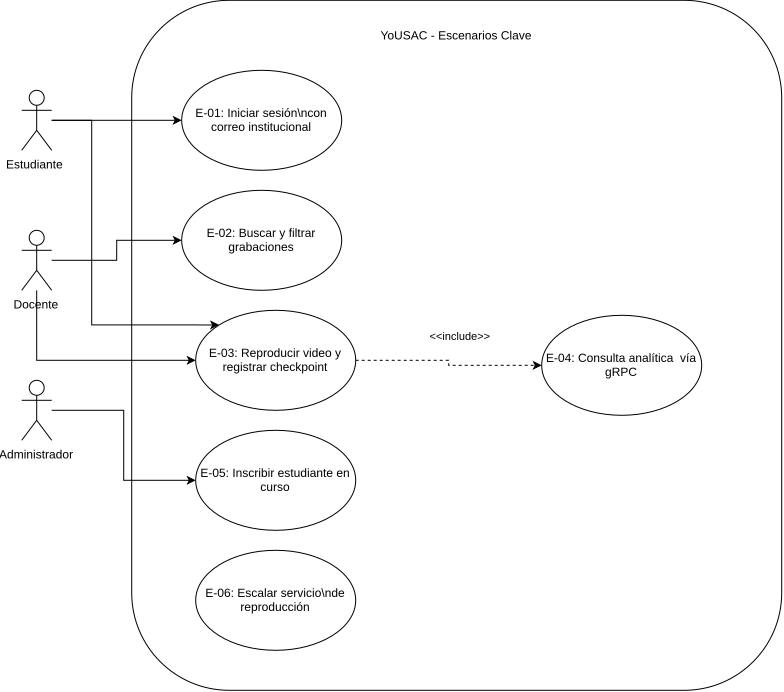
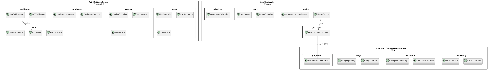
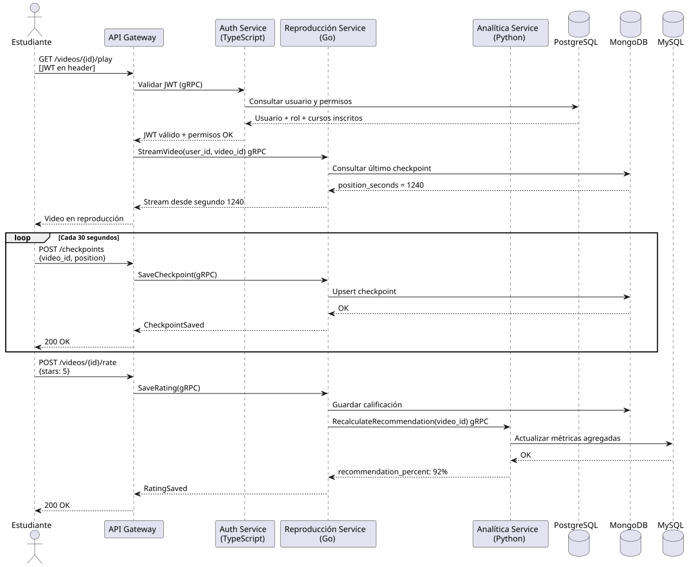
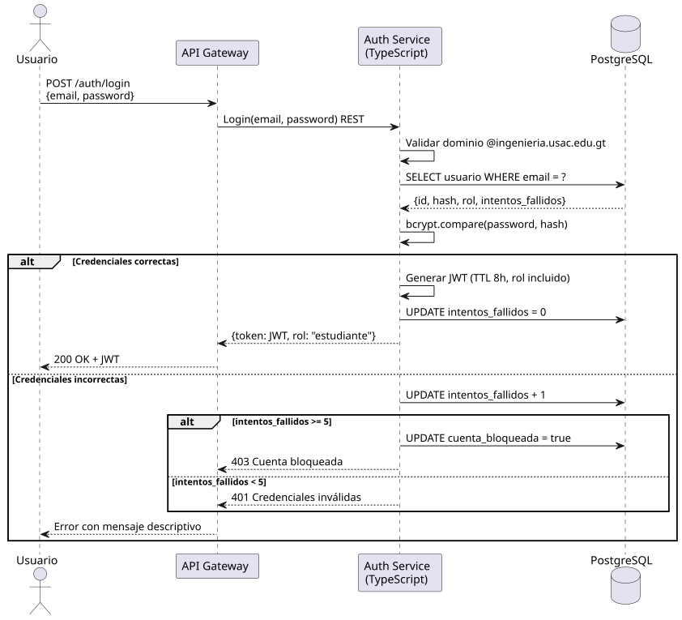
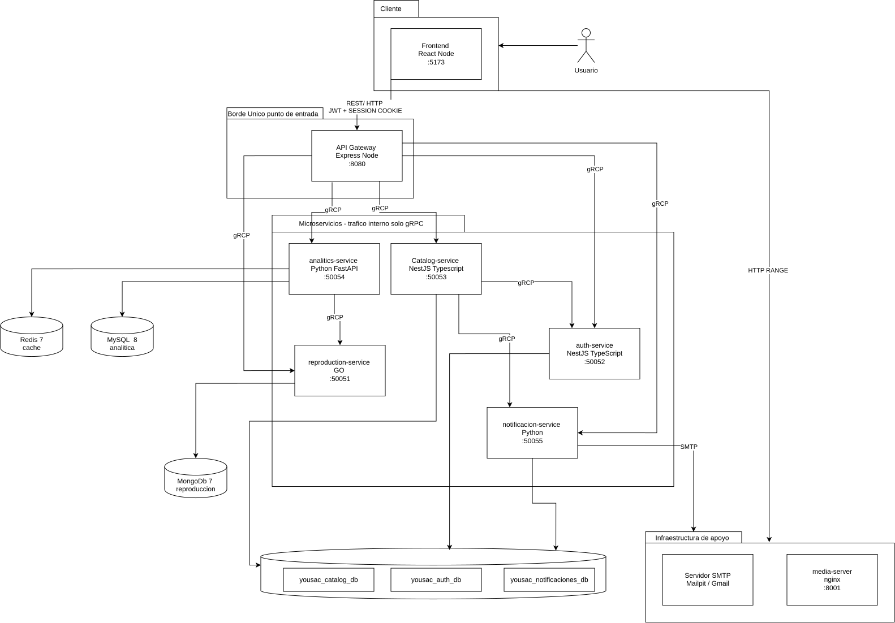
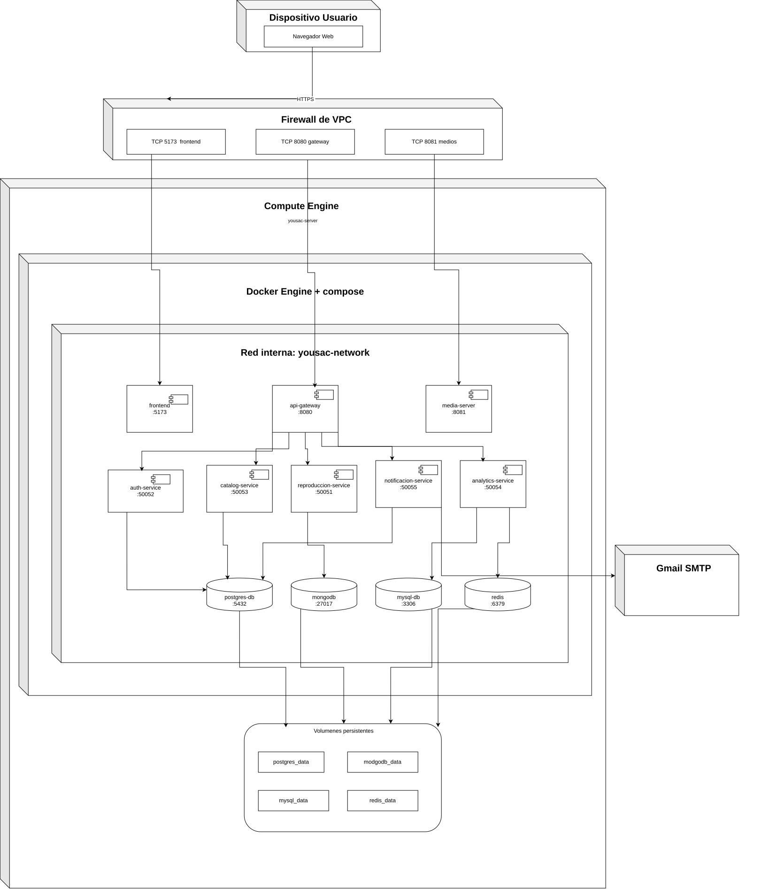

# Vista de Arquitectura 4+1 — YoUSAC

---

## Introducción

El modelo 4+1 de Kruchten describe la arquitectura del sistema YoUSAC desde cinco perspectivas complementarias. Cada vista responde a las preocupaciones de un grupo distinto de stakeholders y juntas forman una descripción completa del sistema.

| Vista | Pregunta que responde | Stakeholder principal |
|-------|----------------------|----------------------|
| Escenarios | ¿Qué hace el sistema? | Todos |
| Lógica | ¿Cómo está organizado internamente? | Desarrolladores |
| Procesos | ¿Cómo se comunican los servicios en ejecución? | Arquitectos / DevOps |
| Componentes | ¿Cómo está estructurado el código? | Desarrolladores |
| Despliegue | ¿Dónde corre cada componente? | DevOps / Infraestructura |

---

## Vista 1: Escenarios (El +1)

### Descripción
La vista de escenarios actúa como el hilo conductor de las demás vistas. Selecciona los casos de uso arquitectónicamente más relevantes que justifican las decisiones de diseño tomadas en YoUSAC.

### Escenarios arquitectónicamente significativos

| ID | Escenario | Vista que valida |
|----|-----------|-----------------|
| E-01 | Un estudiante inicia sesión con correo institucional y el sistema genera un JWT con su rol | Lógica, Procesos |
| E-02 | Un estudiante busca grabaciones filtrando por curso y semestre | Lógica, Componentes |
| E-03 | Un estudiante reproduce un video y el sistema registra su checkpoint cada 30 segundos | Procesos, Despliegue |
| E-04 | El microservicio de Analítica consulta al de Reproducción los checkpoints para calcular métricas | Procesos (gRPC) |
| E-05 | Un Administrador inscribe a un estudiante en un curso y el sistema notifica al estudiante | Lógica, Procesos |
| E-06 | El sistema escala horizontalmente el microservicio de Reproducción ante alta demanda concurrente | Despliegue |

### Justificación de la arquitectura de microservicios
Los escenarios E-03 y E-04 justifican la separación entre el servicio de Reproducción (Go) y el de Analítica (Python), ya que tienen patrones de carga distintos: Reproducción requiere alta frecuencia de escrituras de checkpoints mientras que Analítica realiza lecturas agregadas periódicas. La comunicación gRPC entre ambos garantiza baja latencia en el tráfico east-west.

### Diagrama de Escenarios



---

## Vista 2: Vista Lógica

### Descripción
La vista lógica describe la organización del sistema en términos de sus responsabilidades funcionales. En YoUSAC se estructura en tres dominios de microservicios, cada uno con sus propias capas internas.

### Dominios y responsabilidades

#### Microservicio 1 — Auth/Catálogo (TypeScript + PostgreSQL)
Responsable de la identidad de usuarios, control de acceso basado en roles (RBAC) y la gestión del catálogo de grabaciones.

**Paquetes internos:**
- `auth` — registro, login, generación y validación de JWT
- `users` — gestión de perfiles y roles
- `catalog` — listado, búsqueda y filtrado de grabaciones
- `enrollments` — inscripciones de estudiantes en cursos
- `middleware` — validación de JWT y permisos por rol

#### Microservicio 2 — Reproducción/Checkpoints (Go + MongoDB)
Responsable del streaming de video y el registro del progreso de reproducción de cada usuario.

**Paquetes internos:**
- `streaming` — control del reproductor y sesiones de reproducción
- `checkpoints` — registro y recuperación de posiciones de reproducción
- `ratings` — calificaciones y reseñas de grabaciones
- `grpc_server` — servidor gRPC que expone los datos de reproducción a otros servicios

#### Microservicio 3 — Analítica (Python + MySQL)
Responsable del cálculo de métricas, porcentajes de recomendación y estadísticas de visualización.

**Paquetes internos:**
- `metrics` — cálculo de porcentaje de recomendación y métricas de avance
- `reports` — estadísticas para docentes y administradores
- `grpc_client` — cliente gRPC que consume datos del servicio de Reproducción
- `scheduler` — tareas periódicas de agregación de datos

### Diagrama de Paquetes (Vista Lógica)



---

## Vista 3: Vista de Procesos (gRPC)

### Descripción
La vista de procesos describe el comportamiento del sistema en tiempo de ejecución: cómo se comunican los microservicios, qué protocolos usan y cómo fluyen los datos entre ellos.

### Protocolo de comunicación
- **Norte-Sur (cliente ↔ API Gateway):** HTTP/1.1 con REST y JSON sobre HTTPS
- **Este-Oeste (entre microservicios):** gRPC sobre HTTP/2 con Protobuf

### Definiciones proto

#### checkpoints.proto
```proto
syntax = "proto3";
package reproduccion;

service ReproduccionService {
  rpc GetCheckpoint (CheckpointRequest) returns (CheckpointResponse);
  rpc GetVideoStats (VideoStatsRequest) returns (VideoStatsResponse);
  rpc GetUserProgress (UserProgressRequest) returns (UserProgressResponse);
}

message CheckpointRequest {
  string user_id = 1;
  string video_id = 2;
}

message CheckpointResponse {
  string user_id = 1;
  string video_id = 2;
  int32  position_seconds = 3;
  float  progress_percent = 4;
  bool   completed = 5;
}

message VideoStatsRequest {
  string video_id = 1;
}

message VideoStatsResponse {
  string video_id = 1;
  int32  total_views = 2;
  float  average_progress = 3;
  float  recommendation_percent = 4;
}

message UserProgressRequest {
  string user_id = 1;
  string course_id = 2;
}

message UserProgressResponse {
  string user_id = 1;
  string course_id = 2;
  float  overall_progress = 3;
  repeated VideoProgress videos = 4;
}

message VideoProgress {
  string video_id = 1;
  float  progress_percent = 2;
  bool   completed = 3;
}
```

### Diagrama de Secuencia — Reproducción con Checkpoint



### Diagrama de Secuencia — Autenticación



---

## Vista 4: Vista de Componentes (Desarrollo)

### Descripción
La vista de componentes muestra cómo está organizado el código fuente del proyecto, las dependencias entre módulos y la estructura de carpetas de cada microservicio.

### Estructura del repositorio

```
SA_PRACTICA_CARNET/
├── practica1/
│   └── (documentación de esta práctica)
├── auth-catalog-service/          # TypeScript + NestJS
│   ├── src/
│   │   ├── auth/
│   │   ├── users/
│   │   ├── catalog/
│   │   ├── enrollments/
│   │   └── middleware/
│   ├── proto/
│   │   └── auth.proto
│   ├── Dockerfile
│   └── package.json
├── reproduction-service/          # Go + Gin
│   ├── cmd/
│   ├── internal/
│   │   ├── streaming/
│   │   ├── checkpoints/
│   │   ├── ratings/
│   │   └── grpc/
│   ├── proto/
│   │   └── checkpoints.proto
│   ├── Dockerfile
│   └── go.mod
├── analytics-service/             # Python + FastAPI
│   ├── app/
│   │   ├── metrics/
│   │   ├── reports/
│   │   ├── grpc/
│   │   └── scheduler/
│   ├── proto/
│   │   └── checkpoints_pb2.py
│   ├── Dockerfile
│   └── requirements.txt
├── api-gateway/
│   ├── nginx.conf
│   └── Dockerfile
└── docker-compose.yml
```

### Diagrama de Componentes


---

## Vista 5: Vista de Despliegue

### Descripción
La vista de despliegue describe la infraestructura física y lógica sobre la que corre YoUSAC. El sistema se despliega mediante contenedores Docker orquestados con Docker Compose, con cada microservicio en su propio contenedor aislado.

### Infraestructura

| Contenedor | Imagen base | Puerto interno | Puerto expuesto |
|-----------|-------------|---------------|----------------|
| api-gateway | nginx:alpine | 80 | 443 |
| auth-catalog-service | node:20-alpine | 3000 | — |
| reproduction-service | golang:1.22-alpine | 3001 | — |
| analytics-service | python:3.12-slim | 3002 | — |
| postgres-db | postgres:16 | 5432 | — |
| mongodb | mongo:7 | 27017 | — |
| mysql-db | mysql:8 | 3306 | — |

> Solo el API Gateway está expuesto al exterior. Los microservicios y bases de datos se comunican en una red interna Docker.

### Diagrama de Despliegue



### Docker Compose (referencia)

```yaml
version: '3.8'

networks:
  yousac-network:
    driver: bridge

services:
  api-gateway:
    build: ./api-gateway
    ports:
      - "443:443"
    networks:
      - yousac-network
    depends_on:
      - auth-catalog-service
      - reproduction-service
      - analytics-service

  auth-catalog-service:
    build: ./auth-catalog-service
    environment:
      - DB_HOST=postgres-db
      - DB_PORT=5432
      - JWT_SECRET=${JWT_SECRET}
      - JWT_TTL=8h
    networks:
      - yousac-network
    depends_on:
      - postgres-db

  reproduction-service:
    build: ./reproduction-service
    environment:
      - MONGO_URI=mongodb://mongodb:27017/yousac_reproduction_db
      - GRPC_PORT=50051
    networks:
      - yousac-network
    depends_on:
      - mongodb

  analytics-service:
    build: ./analytics-service
    environment:
      - MYSQL_HOST=mysql-db
      - MYSQL_PORT=3306
      - GRPC_REPRODUCTION_HOST=reproduction-service:50051
    networks:
      - yousac-network
    depends_on:
      - mysql-db
      - reproduction-service

  postgres-db:
    image: postgres:16
    environment:
      - POSTGRES_DB=yousac_auth_db
      - POSTGRES_USER=${PG_USER}
      - POSTGRES_PASSWORD=${PG_PASSWORD}
    networks:
      - yousac-network

  mongodb:
    image: mongo:7
    networks:
      - yousac-network

  mysql-db:
    image: mysql:8
    environment:
      - MYSQL_DATABASE=yousac_analytics_db
      - MYSQL_ROOT_PASSWORD=${MYSQL_PASSWORD}
    networks:
      - yousac-network
```