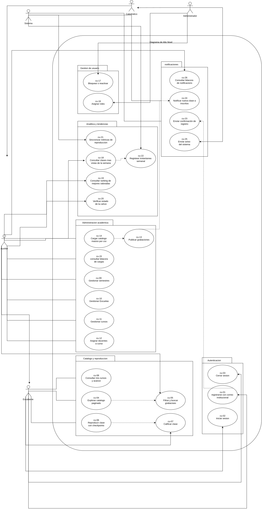
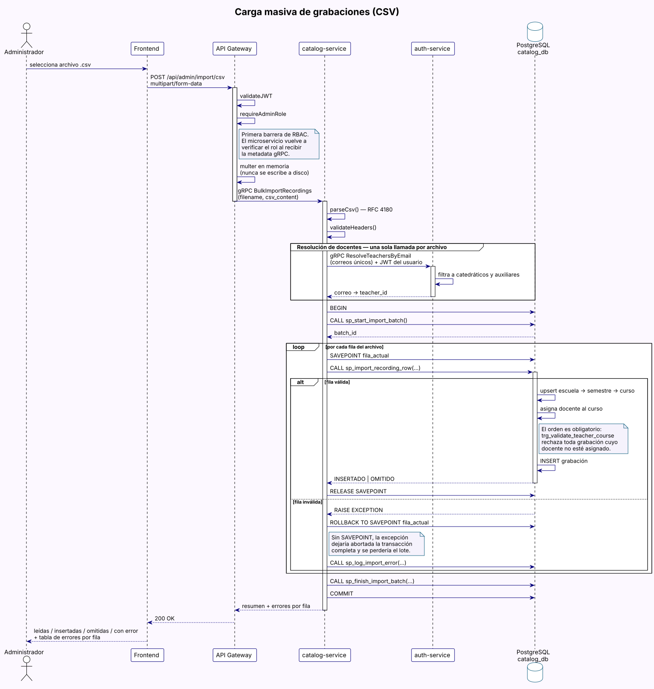
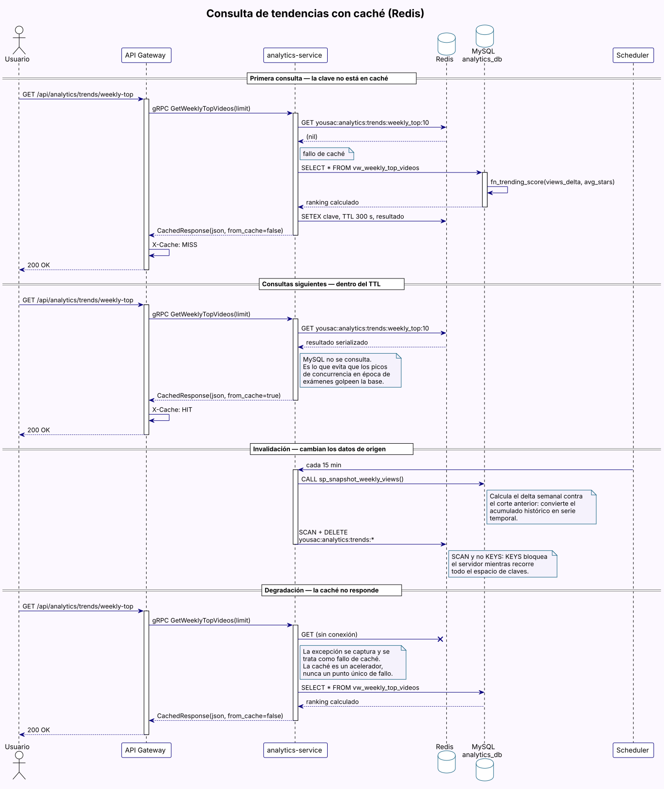
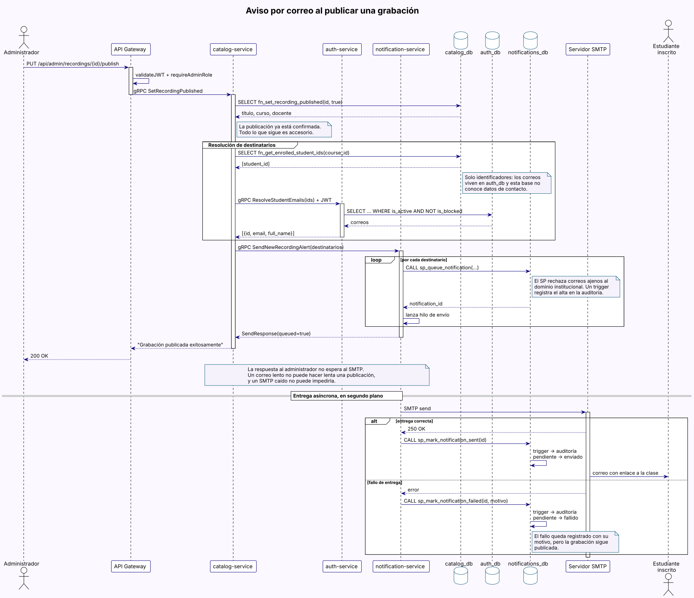

# Vista de Arquitectura 4+1 — YoUSAC

---

## Introducción

El modelo 4+1 de Kruchten describe la arquitectura del sistema YoUSAC desde cinco perspectivas complementarias. Cada vista responde a las preocupaciones de un grupo distinto de interesados y juntas forman una descripción completa del sistema.

| Vista | Pregunta que responde | Interesado principal |
|-------|----------------------|----------------------|
| Escenarios | ¿Qué hace el sistema? | Todos |
| Lógica | ¿Cómo está organizado internamente? | Desarrolladores |
| Procesos | ¿Cómo se comunican los servicios en ejecución? | Arquitectos / DevOps |
| Componentes | ¿Cómo está estructurado el código? | Desarrolladores |
| Despliegue | ¿Dónde corre cada componente? | DevOps / Infraestructura |

### Resumen de la arquitectura

YoUSAC es una plataforma de video bajo demanda para el acervo académico de la Facultad de Ingeniería, construida sobre una **arquitectura de microservicios políglota**.

| Característica | Decisión |
|---|---|
| Lenguajes del backend | Go, TypeScript y Python, simultáneos |
| Comunicación interna | Exclusivamente gRPC sobre HTTP/2 con Protocol Buffers |
| Exposición externa | API Gateway como único punto de entrada |
| Persistencia | *Database per Microservice*: PostgreSQL, MongoDB y MySQL |
| Caché | Redis con políticas de expiración por familia de consulta |
| Identidad | JWT con Session Cookies `HttpOnly` y `Secure` |
| Lógica de datos | Procedimientos almacenados, vistas, funciones y triggers |
| Orquestación | Docker Compose, con entornos local y de nube diferenciados |

---

## Vista 1: Escenarios (El +1)

### Descripción

La vista de escenarios actúa como hilo conductor de las demás. Selecciona los casos de uso arquitectónicamente más relevantes: aquellos que justifican una decisión de diseño y que, de cambiar, obligarían a replantear la arquitectura.

### Escenarios arquitectónicamente significativos

| ID | Escenario | Vista que valida | Decisión que justifica |
|----|-----------|------------------|------------------------|
| E-01 | Un estudiante inicia sesión con correo institucional y el sistema genera un JWT con su rol | Lógica, Procesos | Validación de dominio en la capa de datos y en el servicio |
| E-02 | Un estudiante busca grabaciones combinando filtros de curso, semestre y docente | Lógica, Componentes | Paginación resuelta en la base de datos, no en memoria |
| E-03 | Un estudiante reproduce un video y el sistema registra su checkpoint cada 30 segundos | Procesos, Despliegue | Servicio de reproducción en Go, optimizado para escrituras frecuentes |
| E-04 | El servicio de Analítica consulta al de Reproducción para calcular métricas | Procesos | gRPC entre microservicios, sin REST interno |
| E-05 | Cientos de estudiantes consultan el mismo ranking de tendencias en época de exámenes | Procesos, Despliegue | Caché Redis con TTL, que evita recalcular el agregado en cada petición |
| E-06 | Un administrador carga un CSV con cientos de grabaciones de semestres anteriores | Lógica, Procesos | Transacción con `SAVEPOINT` por fila, para aislar los registros inválidos |
| E-07 | Al publicarse una clase, los estudiantes inscritos reciben un aviso por correo | Procesos | Envío asíncrono: el correo no bloquea ni condiciona la publicación |
| E-08 | Redis deja de responder durante un pico de carga | Procesos | Degradación elegante: las consultas siguen resolviéndose contra la base |
| E-09 | El sistema se despliega en la nube con credenciales distintas a las de desarrollo | Despliegue | Dos archivos de orquestación y configuración externalizada en `.env` |

### Justificación de la arquitectura de microservicios

Los escenarios **E-03** y **E-04** justifican separar Reproducción (Go) de Analítica (Python): tienen patrones de carga opuestos. Reproducción recibe escrituras pequeñas y muy frecuentes —un checkpoint por usuario y video cada 30 segundos—, mientras que Analítica ejecuta lecturas agregadas y periódicas. Unirlos obligaría a dimensionar un solo servicio para dos perfiles incompatibles.

El escenario **E-05** justifica la introducción de Redis. El ranking de tendencias es idéntico para todos los usuarios y su cálculo agrega miles de filas; recalcularlo por petición desperdicia trabajo. El **E-08** matiza la decisión: la caché acelera, pero no puede convertirse en un punto único de fallo.

El escenario **E-06** justifica que la carga masiva corra dentro de una transacción con puntos de retorno por fila. PostgreSQL aborta la transacción completa ante cualquier excepción, de modo que sin `SAVEPOINT` un solo registro defectuoso invalidaría el archivo entero.

El escenario **E-07** justifica que Notificaciones sea un microservicio aparte y que el envío no sea bloqueante: un servidor de correo lento o caído no debe impedir que un usuario se registre o que una clase se publique.

### Diagrama de Escenarios


### Diagrama de Casos de Uso de Alto Nivel



---

## Vista 2: Vista Lógica

### Descripción

La vista lógica describe la organización del sistema según sus responsabilidades funcionales. YoUSAC se estructura en **seis microservicios**, cada uno dueño exclusivo de su dominio y de su base de datos.

### Distribución políglota

El lenguaje de cada servicio no es arbitrario: responde al perfil de carga de su dominio.

| Microservicio | Lenguaje | Motivo de la elección |
|---|---|---|
| Reproducción | **Go** | Alta concurrencia de escrituras pequeñas (checkpoints y eventos) |
| Autenticación | **TypeScript** | Dominio de identidad y roles, con tipado estricto sobre reglas de negocio |
| Catálogo | **TypeScript** | Comparte modelo de tipos y contratos con Autenticación |
| Analítica | **Python** | Agregaciones, cálculo de métricas y tareas programadas |
| Notificaciones | **Python** | Plantillas y entrega SMTP, sin exigencias de latencia |
| API Gateway | **Node.js** | Traducción REST ↔ gRPC con el mismo ecosistema de contratos |

### Dominios y responsabilidades

#### auth-service — Identidad y control de acceso
*TypeScript · NestJS · PostgreSQL (`yousac_auth_db`)*

Dueño de los usuarios, los cuatro roles del sistema y las sesiones.

- `auth` — registro, inicio de sesión, generación y revocación de JWT
- `users` — perfiles, asignación de roles, bloqueo de cuentas y resolución de identidades para otros servicios
- `middleware` — guardas de autenticación y de rol sobre la capa gRPC
- `common` — acceso a datos y cliente gRPC hacia Notificaciones

#### catalog-service — Catálogo académico
*TypeScript · NestJS · PostgreSQL (`yousac_catalog_db`)*

Dueño de semestres, escuelas, cursos, grabaciones e inscripciones.

- `catalog` — listado paginado, filtros combinados y detalle de grabaciones
- `admin` — CRUD de entidades académicas y publicación de grabaciones
- `import` — ingesta masiva desde CSV, con parser propio y control transaccional
- `enrollments` — inscripción y baja de estudiantes
- `common` — acceso a datos, transacciones y clientes gRPC hacia Autenticación y Notificaciones

#### reproduction-service — Reproducción y progreso
*Go · MongoDB (`yousac_reproduction_db`)*

Dueño del progreso de visualización y las calificaciones.

- `checkpoints` — registro y recuperación de la posición exacta de reproducción
- `ratings` — calificaciones y reseñas
- `sessions` — eventos de reproducción: inicio, pausa, reanudación y fin
- `grpc/server` — superficie gRPC consumida por el gateway y por Analítica

#### analytics-service — Métricas y tendencias
*Python · FastAPI · MySQL (`yousac_analytics_db`) · Redis*

Dueño de las métricas agregadas y los rankings.

- `metrics` — porcentaje de recomendación y progreso por estudiante
- `reports` — estadísticas para docentes y administradores
- `trends` — clases más vistas de la semana, mejor valoradas y cursos en tendencia
- `cache` — capa de caché sobre Redis, con TTL e invalidación por patrón
- `scheduler` — sincronización periódica de métricas e instantáneas semanales
- `grpc` — servidor propio y cliente hacia Reproducción

#### notification-service — Correo institucional
*Python · PostgreSQL (`yousac_notifications_db`)*

Dueño de los avisos por correo y su bitácora.

- `notifications` — encolado, entrega asíncrona y consulta de la bitácora
- `mailer` — transporte SMTP y plantillas HTML
- `grpc/server` — superficie consumida por Autenticación y Catálogo

#### api-gateway — Punto de entrada único
*Node.js · Express*

No es dueño de ningún dominio: traduce REST a gRPC, valida el JWT como primera barrera y aplica CORS y cookies de sesión. Es el único componente que habla HTTP con el navegador.

### Regla de propiedad de datos

Ningún microservicio consulta las tablas de otro. Cuando necesita un dato ajeno guarda su identificador y lo resuelve por gRPC en tiempo de ejecución.

> **Ejemplo.** `recordings` almacena `teacher_id`, pero la fila del docente vive en `yousac_auth_db`. Al publicar una grabación, `catalog-service` obtiene los identificadores de los inscritos desde su propia base y pide los correos a `auth-service` por gRPC. No existe clave foránea entre ambas: es una **referencia lógica**.

### Diagrama de Paquetes


---

## Vista 3: Vista de Procesos

### Descripción

La vista de procesos describe el comportamiento en tiempo de ejecución: qué protocolos se usan, cómo fluyen los datos y qué ocurre cuando algo falla.

### Protocolos por tipo de tráfico

| Tráfico | Protocolo | Justificación |
|---|---|---|
| Norte-sur (navegador ↔ gateway) | REST/JSON sobre HTTPS | El navegador no habla gRPC de forma nativa |
| Este-oeste (entre microservicios) | **gRPC sobre HTTP/2 con Protobuf** | Contratos estrictos, menor sobrecarga y multiplexación |
| Streaming de video | HTTP con peticiones por rango | Permite saltar a un segundo concreto sin descargar el archivo completo |
| Correo saliente | SMTP con TLS | Protocolo estándar del dominio |

Está **prohibido el uso de REST entre microservicios**. El único HTTP que conservan es su endpoint `/health`, que consume el healthcheck del orquestador y no transporta lógica de negocio.

### Contratos gRPC

| Archivo | Servicio | Consumidores |
|---|---|---|
| `auth.proto` | `AuthService` | api-gateway, catalog-service |
| `catalog.proto` | `CatalogService` | api-gateway |
| `checkpoints.proto` | `ReproduccionService` | api-gateway, analytics-service |
| `analytics.proto` | `AnalyticsService` | api-gateway |
| `notifications.proto` | `NotificationService` | auth-service, catalog-service, api-gateway |

Los contratos viven en `proto/` y se replican en el contexto de compilación de cada servicio. Esa duplicación es necesaria —cada imagen debe contener los suyos— y es la parte más fácil de desincronizar del repositorio, por lo que la integración continua verifica en cada cambio que las doce copias coincidan con el original.

### Comunicación entre microservicios

Hasta la fase anterior todo el tráfico nacía en el gateway. El proyecto incorpora tres llamadas directas entre servicios:

| Origen | Destino | Motivo |
|---|---|---|
| `catalog-service` | `auth-service` | Resolver correos de docentes durante la carga CSV y de estudiantes al publicar |
| `catalog-service` | `notification-service` | Avisar de una clase publicada |
| `auth-service` | `notification-service` | Confirmar un registro |
| `analytics-service` | `reproduction-service` | Sincronizar métricas de visualización |

Estas llamadas **reenvían el JWT del usuario que originó la operación**. No viajan de forma anónima ni con credenciales de servicio: el microservicio destino les aplica el mismo control de acceso que a cualquier otro consumidor.

### Manejo de fallos

| Situación | Comportamiento | Fundamento |
|---|---|---|
| Redis no responde | La consulta se resuelve contra MySQL | La caché acelera, no habilita |
| El servidor SMTP falla | La operación de negocio se completa; el fallo queda en la bitácora | El correo es un efecto secundario |
| Una fila del CSV es inválida | Se revierte solo esa fila y el lote continúa | `SAVEPOINT` por registro |
| Un procedimiento almacenado rechaza la operación | El mensaje llega literal al usuario como HTTP 400 | Las reglas viven en la base y deben poder explicarse |
| Un microservicio no responde | El gateway traduce el código gRPC a su equivalente HTTP | El cliente recibe un error interpretable |

### Diagramas de Secuencia

#### Autenticación institucional


#### Reproducción con checkpoint


#### Carga masiva desde CSV

Documenta el aislamiento por fila mediante `SAVEPOINT` y el orden obligatorio de resolución —escuela, semestre, curso, asignación docente y solo entonces la grabación—, impuesto por el trigger que valida la asignación.



#### Consulta de tendencias con caché

Cubre los tres caminos posibles: fallo de caché, acierto y caída del servicio de caché.



#### Notificación de nueva clase publicada

Muestra por qué la respuesta al administrador no espera al servidor SMTP.



---

## Vista 4: Vista de Componentes (Desarrollo)

### Descripción

La vista de componentes muestra la organización del código fuente, las dependencias entre módulos y la estructura del repositorio.

### Estructura del repositorio

```
SA_PROYECTO_202300449-/
├── proto/                          # Contratos gRPC — fuente única
│   ├── auth.proto
│   ├── catalog.proto
│   ├── checkpoints.proto
│   ├── analytics.proto
│   └── notifications.proto
│
├── api-gateway/                    # Node.js + Express
│   ├── index.js                    # Rutas REST y clientes gRPC
│   ├── proto/                      # Copias de los contratos
│   └── Dockerfile
│
├── auth-service/                   # TypeScript + NestJS
│   ├── src/
│   │   ├── auth/                   # Registro, login, JWT
│   │   ├── users/                  # Roles, bloqueo, resolución de identidades
│   │   ├── middleware/             # Guardas gRPC de autenticación y rol
│   │   └── common/                 # Base de datos y cliente de notificaciones
│   ├── proto/
│   └── Dockerfile
│
├── catalog-service/                # TypeScript + NestJS
│   ├── src/
│   │   ├── catalog/                # Listado paginado y filtros
│   │   ├── admin/                  # CRUD académico y publicación
│   │   ├── import/                 # Ingesta CSV y parser RFC 4180
│   │   ├── enrollments/            # Inscripciones
│   │   ├── middleware/
│   │   └── common/                 # Transacciones y clientes gRPC
│   ├── proto/
│   └── Dockerfile
│
├── reproduction-service/           # Go
│   ├── cmd/                        # Punto de entrada
│   ├── internal/
│   │   ├── checkpoints/
│   │   ├── ratings/
│   │   ├── database/
│   │   └── grpc/server/
│   ├── proto/
│   └── Dockerfile
│
├── analytics-service/              # Python + FastAPI
│   ├── app/
│   │   ├── metrics/                # Métricas por video y curso
│   │   ├── reports/                # Reportes agregados
│   │   ├── trends/                 # Tendencias semanales
│   │   ├── cache/                  # Capa de caché sobre Redis
│   │   ├── scheduler/              # Tareas periódicas
│   │   └── grpc/                   # Servidor y cliente
│   ├── proto/
│   └── Dockerfile
│
├── notification-service/           # Python
│   ├── app/
│   │   ├── notifications/          # Encolado y bitácora
│   │   ├── mailer/                 # SMTP y plantillas HTML
│   │   └── grpc/
│   ├── proto/
│   └── Dockerfile
│
├── frontend/                       # React + Vite
│   ├── src/
│   │   ├── pages/                  # Login, catálogo, reproductor
│   │   │   └── admin/              # Secciones del panel
│   │   ├── components/             # Modal, Toast, Paginación
│   │   ├── hooks/
│   │   └── services/               # Cliente HTTP tipado
│   ├── nginx.conf                  # Configuración de la imagen de producción
│   └── Dockerfile                  # Multi-etapa: desarrollo y producción
│
├── DB/                             # Esquemas y datos
│   ├── init_postgres.sql
│   ├── auth_db.sql
│   ├── catalog_db.sql
│   ├── practica3_sps.sql
│   ├── notifications_db.sql
│   ├── proyecto_fase1_sps.sql
│   ├── analytics_mysql.sql
│   ├── reproduction_mongodb.js
│   ├── docker/                     # Dockerfile por motor
│   └── samples/                    # CSV de ejemplo
│
├── redis/                          # Caché
│   ├── redis.conf
│   └── Dockerfile
│
├── media/                          # Servidor de medios
│   ├── nginx.conf
│   ├── videos/
│   └── Dockerfile
│
├── .github/workflows/ci.yml        # Integración continua
├── Documentation/                  # Artefactos de ingeniería
├── .env.example                    # Plantilla de configuración
├── docker-compose.local.yml
└── docker-compose.cloud.yml
```

### Dependencias entre componentes

| Componente | Depende de | Tipo |
|---|---|---|
| frontend | api-gateway | REST |
| frontend | media-server | HTTP con rangos |
| api-gateway | los cinco microservicios | gRPC |
| catalog-service | auth-service, notification-service | gRPC |
| auth-service | notification-service | gRPC |
| analytics-service | reproduction-service, Redis | gRPC / TCP |
| Cada microservicio | su propia base de datos | Controlador nativo |

### Objetos programables en la base de datos

| Base | Procedimientos | Funciones | Vistas | Triggers |
|---|---|---|---|---|
| `yousac_auth_db` | 6 | 4 | 3 | 3 |
| `yousac_catalog_db` | 20 | 12 | 8 | 4 |
| `yousac_notifications_db` | 3 | 4 | 2 | 2 |
| `yousac_analytics_db` | 5 | 3 | 6 | 3 |
| **Total** | **34** | **23** | **19** | **12** |

*Cifras verificadas contra el catálogo de sistema de cada motor. El conteo de
funciones incluye las que respaldan a los triggers.*

Toda escritura sobre entidades académicas pasa por un procedimiento almacenado. Los servicios no ejecutan `INSERT`, `UPDATE` ni `DELETE` sueltos sobre esas tablas.

### Diagrama de Componentes


---

## Vista 5: Vista de Despliegue

### Descripción

El sistema se despliega en contenedores orquestados con Docker Compose, en dos entornos diferenciados: desarrollo local y nube sobre Google Cloud Platform.

### Servicios desplegados

| Contenedor | Imagen base | Puerto interno | Expuesto en local | Expuesto en nube |
|---|---|---|---|---|
| frontend | node:20 / nginx:alpine | 5173 / 80 | 5173 | 5173 |
| api-gateway | node:20-alpine | 8080 | 8080 | 8080 |
| media-server | nginx:alpine | 80 | 8081 | 8081 |
| auth-service | node:20-alpine | 50052 · 3000 | ambos | — |
| catalog-service | node:20-alpine | 50053 · 3003 | ambos | — |
| reproduction-service | golang:1.25-alpine | 50051 · 3001 | ambos | — |
| analytics-service | python:3.11-slim | 50054 · 3002 | ambos | — |
| notification-service | python:3.11-slim | 50055 · 3004 | ambos | — |
| postgres-db | postgres:16-alpine | 5432 | 5432 | — |
| mongodb | mongo:7 | 27017 | 27017 | — |
| mysql-db | mysql:8 | 3306 | 3306 | — |
| redis | redis:7-alpine | 6379 | 6379 | — |
| mailpit | axllent/mailpit | 1025 · 8025 | ambos | — |

> En la nube solo se publican tres puertos. Las bases de datos, la caché y los puertos gRPC quedan accesibles únicamente dentro de la red interna de Docker: exponerlos a internet sería un riesgo innecesario y contradiría el principio de punto de entrada único.

### Diferencias entre entornos

| Aspecto | Local | Nube |
|---|---|---|
| Archivo | `docker-compose.local.yml` | `docker-compose.cloud.yml` |
| Credenciales | Valores por defecto de desarrollo | Obligatorias vía `.env`; el despliegue aborta si falta alguna |
| Puertos de datos | Publicados, para inspección | No publicados |
| Política de reinicio | `unless-stopped` | `always` |
| Límites de memoria | Sin límite | Por servicio |
| Frontend | Servidor de Vite con recarga en caliente | Build estático servido por nginx |
| Correo | Mailpit, con bandeja web | Gmail SMTP con TLS |
| Bases de datos | Scripts montados como volumen | Horneados en la imagen |

### Infraestructura de nube

| Recurso | Configuración |
|---|---|
| Proveedor | Google Cloud Platform |
| Servicio | Compute Engine |
| Máquina | `e2-standard-4` — 4 vCPU, 16 GB |
| Sistema | Ubuntu 22.04 LTS, 50 GB SSD |
| Región | `us-central1` |
| Persistencia | Volúmenes con nombre para las tres bases y la caché |

Se eligió Compute Engine con Docker Compose sobre alternativas administradas porque el sistema necesita **estado persistente**: tres motores de base de datos, una caché y archivos de video. Reproducirlo en servicios administrados exigiría reescribir la orquestación y multiplicaría el costo, sin aportar nada a los objetivos del proyecto.

### Integración continua

El repositorio ejecuta un pipeline en cada cambio hacia `main` o `develop`, con un job por familia tecnológica:

| Job | Verifica |
|---|---|
| Contratos | Que las 12 copias de los `.proto` coincidan con el original |
| TypeScript | Tipos y compilación de auth, catalog y frontend |
| API Gateway | Sintaxis y carga de los cinco contratos |
| Python | Compilación e importación de analytics y notifications |
| Go | Formato, análisis estático y compilación |
| Compose | Validez de ambos entornos y ausencia de credenciales en el repositorio |
| Imágenes | Construcción de las doce imágenes |

Las imágenes solo se construyen si todo lo anterior pasó: compilar doce imágenes es la etapa más lenta y no tiene sentido hacerlo sobre código que ya falló.

### Diagrama de Despliegue


---

## Trazabilidad entre vistas

| Escenario | Vista Lógica | Vista de Procesos | Vista de Despliegue |
|---|---|---|---|
| E-01 Autenticación | `auth-service` | Secuencia de autenticación | postgres-db |
| E-02 Búsqueda con filtros | `catalog-service` | `fn_get_catalog_paginated` | postgres-db |
| E-03 Checkpoint | `reproduction-service` | Secuencia de reproducción | mongodb |
| E-04 Sincronización | `analytics-service` | gRPC hacia Reproducción | mysql-db |
| E-05 Tendencias | `analytics-service/trends` | Secuencia de caché | redis |
| E-06 Carga CSV | `catalog-service/import` | Secuencia de carga CSV | postgres-db |
| E-07 Notificación | `notification-service` | Secuencia de notificaciones | mailpit / Gmail |
| E-08 Caída de la caché | `analytics-service/cache` | Degradación a base de datos | redis |
| E-09 Despliegue | — | — | `docker-compose.cloud.yml` |
